# 풀림 클래스봇 — Storyboard

> **버전** v1.0 · 2026-04-30
> **스코프** 클래스봇 도메인 락인 산출물 17개 화면
> **참조** docs/07_풀림_클래스봇_핸드오프.md, docs/03_풀림_스터디_마스터.md
> **타겟 독자** PM·디자이너·엔지니어 — 다음 작업 시 이 문서를 보고 화면 단위로 수정 지점을 찾을 수 있어야 함

---

## 0. 한 줄 요약

> **클래스봇은 선생님이 자신의 수업·교안·목소리를 AI에 이식해 "디지털 분신" 수업 동반자를 만드는 도구.**
> 학생은 등록된 봇과 1:1 대화/과제/리플레이로 만나고, 교사는 봇을 만들고·라이브로 운영하고·결과를 검토한다. B2B 매출의 핵심 드라이버.

---

## 1. 도메인 IA

### 1.1 학생 사이드바 (`/classbot`)

```
풀림 클래스봇 (B2B)
├─ 홈              /classbot
├─ 봇 대화          /classbot/chat
├─ 리플레이         /classbot/replay
├─ 봇 찾기 (locked) /classbot/discover  (v2 future)
└─ 소개하기         /classbot/onboarding
```

### 1.2 교사 사이드바 (`/teacher/*`)

```
워크스페이스
├─ 홈 대시보드     /teacher
├─ 내 클래스봇      /teacher/classbot   (3개 봇 운영, 라이브 모니터링)
└─ 봇 빌더          /teacher/builder    (8단계 위저드)

클래스룸
├─ 실시간 수업      /teacher/live
├─ 즉석 퀴즈        /teacher/quiz
└─ 수업 리플레이    /teacher/replay     (큐 + 검토 + 발송)

평가
├─ 리포트 센터      /teacher/reports
└─ 채점 허브        /teacher/grading

라이브러리
├─ 템플릿 마켓      /teacher/templates
└─ 봇 설정          /teacher/settings
```

---

## 2. 데이터 흐름 — 한 장 요약

### 2.1 봇 만들기 → 학생 배정

```
교사 /teacher/builder (8단계 위저드)
  ↓
ClassBot 엔티티 생성 (페르소나·교안·Scope·평가·안전)
  ↓ (반 선택 → 배포)
StudentEnrollment 자동 생성 (교사 배정 모델)
  ↓
학생 사이드바에 봇 자동 등장 (수학이 형·영어 누나·과학 쌤)
```

### 2.2 과제 흐름 — Assignment

```
교사 /teacher/classbot 또는 /teacher/quiz
  ↓ (과제 발사)
Assignment 생성 (subject + 단원 범위 + 문항 + 난이도 + due)
  ↓
학생 /classbot 홈 hero (오늘 풀어야 할 것)
  ↓ (solveHref deep-link 클릭)
/q/infinity/solve?assignmentId=...&subject=...&from=...&to=... (Q 도메인)
```

### 2.3 리플레이 흐름

```
교사 라이브 수업 진행 중
  ↓ (수업 종료)
status: 'processing' — AI(T3)가 트랜스크립트·핵심 메시지·집중도 추출 (~90초)
  ↓
status: 'review' — 교사 검토 (편집·라인 노출 토글)
  ↓ (학생 발송 승인)
status: 'sent' — 학생 사이드 /classbot/replay 에 등장
  ↓
학생 시청 (재생·북마크·시점 질문) → 시청 통계로 환원
```

---

# 3. 학생 화면

## 3.1 `/classbot` — 홈

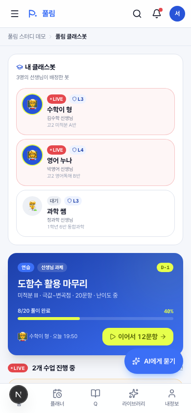

**역할** 학생 진입 첫 화면. 등록된 봇 N개를 한 눈에 + 가장 급한 과제 + 라이브 진행 안내.

**핵심 영역**

- **내 클래스봇 strip** — 3봇 카드 (수학이 형·영어 누나·과학 쌤). LIVE 봇은 lemon ring으로 강조, 아닌 봇은 회색.
- **오늘 풀어야 할 것 hero** — 가장 급한 Assignment (D-1, 8/20 진행중). 봇 이모지 + 발송 시각 + "이어서 N문항" CTA.
- **LIVE 진행 중 안내** — 라이브 봇이 있으면 LiveQuizCard 노출.
- **받은 과제 리스트** — 봇 처방·시험 대비 등 후순위.
- **빠른 진입** — 봇 대화 / 리플레이 / 봇 찾기.
- **모니터링 안내** — 한 줄: "등록된 선생님들이 활동을 실시간으로 봐요."

**컴포넌트** `app/(student)/classbot/page.tsx` · `LiveQuizCard`

**데이터** `getMyBots()` · `studentAssignments` · `classRoster`

**수정 포인트** 카드 hero 톤 바꾸려면 `PrimaryAssignmentCard`. 봇 카드 강조 룰은 `BotCard`. 빠른 진입 항목 추가는 같은 페이지의 grid 섹션.

---

## 3.2 `/classbot/chat` — 봇 대화

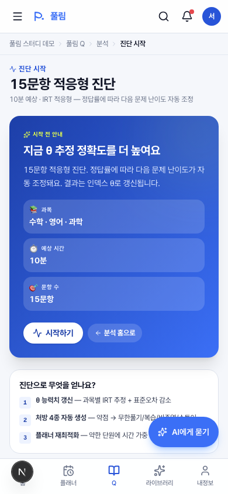

**역할** 학생-봇 1:1 대화. 봇 전환·Scope 표시·교사 모니터링 안내.

**핵심 영역**

- **봇 선택 chip strip** — 3봇 가로 스크롤. 활성 봇 파란색, 라이브 봇은 빨간 dot.
- **봇 정체성 헤더** — 다크 그라데이션 + 아바타 + "수학이 형 — 김수학 선생님의 디지털 분신" + Scope 배지(L3) + 톤·Tier.
- **모니터링 알림** — "선생님이 이 대화를 실시간으로 봐요. 시험 기간엔 자동 차단."
- **채팅 영역** — 학생/봇 말풍선. 봇 응답은 lemon dot + 봇 이름.
- **빠른 질문 chips** — "극값 어떻게 찾아요?" 같은 사전 작성된 prompt.
- **입력창** + 전송 버튼.

**컴포넌트** `app/(student)/classbot/chat/page.tsx` (use client) · 내부 ChatPanel은 `key={bot.id}` 패턴으로 봇 전환 시 state 자연 리셋.

**데이터** `getMyBots()` · `classbotChatGreeting` · `classbotQuickPrompts` · `pickClassbotReply()`

**수정 포인트** 봇별 인사말은 `greetingFor(bot)` 함수. 응답 라우팅은 `lib/mock/phase1.ts`의 `pickClassbotReply`. 새 quick prompt는 `classbotQuickPrompts` 배열.

---

## 3.3 `/classbot/replay` — 리플레이 리스트

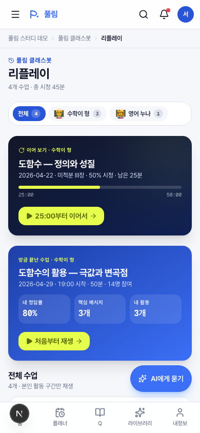

**역할** 발송된(sent) 리플레이만 학생에게 노출. 봇별 필터 + 이어 보기 hero + 시청 진도 표시.

**핵심 영역**

- **봇 필터 chip** — 전체 4 / 수학이 형 3 / 영어 누나 1.
- **이어 보기 hero** — 진도 1초~끝 사이인 리플레이 우선. 진도 바·남은 시간 표시.
- **방금 끝난 수업 hero** — 가장 최근 리플레이.
- **전체 수업 행** — 시청 상태 (시청 완료 / N% 보는 중 / 안 봄) · 진도 바 · "이어서/다시/재생" CTA.
- **프라이버시 안내** — "교사·봇 발언과 내 활동·전체 공유 순간만…"

**컴포넌트** `app/(student)/classbot/replay/page.tsx` (use client) · `FilterChip`·`ContinueWatching`·`LatestHero`·`ReplayRow`

**데이터** `getSentReplays()` · `classBots` (필터용)

**수정 포인트** 필터 로직은 `botFilters` useMemo. "이어 보기" 판정 조건을 바꾸려면 `inProgress` 라인.

---

## 3.4 `/classbot/replay/[id]` — 리플레이 플레이어

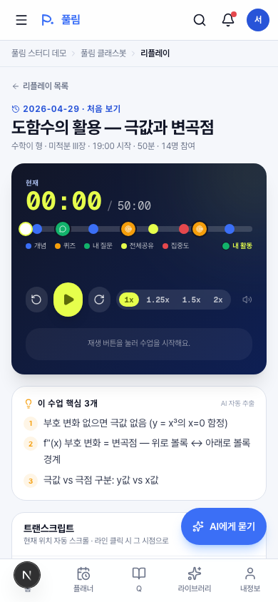

**역할** 50분 수업을 진짜로 재생할 수 있는 플레이어. 4 레이어 (스크러버·트랜스크립트·집중도·내 활동) + 북마크 + 시점별 선생님 질문.

**핵심 영역**

- **헤더 메타** — 수업 일자 + 제목 + 봇 정보 + 시청 상태.
- **Player Surface (다크 그라데이션)** — 큰 시간 디스플레이 `00:00 / 50:00`. 스크러버 + 8 마커 (개념·퀴즈·내 질문·전체공유·집중도). 컨트롤: ±10초 / 재생-일시정지 / 1x·1.25x·1.5x·2x. 자막 — 현재 발화자 라인 표시.
- **핵심 메시지 3개** — AI 자동 추출 (편집은 교사 검토 페이지에서).
- **트랜스크립트** — 스크롤 자동 동기화. 현재 라인 lemon ring. 클릭 → seek.
- **반 집중도 히트맵** — 1분 50칸. 클릭 → seek.
- **북마크** — "지금 위치 저장" CTA. 저장된 북마크 클릭 → seek.
- **시점별 선생님 질문** — `@MM:SS` 태그 + composer. 답변 도착 표시.

**컴포넌트** `components/classbot/replay-player.tsx` (use client, ~600 lines) · 내부 `PlayerSurface`·`TranscriptStream`·`FocusHeatmap`·`BookmarksPanel`·`TeacherQuestionsPanel`

**데이터** `studentReplays[id]` (전체 transcript·focusBins·bookmarks·teacherQuestions 포함)

**수정 포인트** 재생 틱은 100ms `setInterval`. 트랜스크립트 자동 스크롤은 `currentLineIdx` useEffect. 북마크 추가 로직은 `addBookmark()`. 전부 한 파일 안.

---

## 3.5 `/classbot/discover` — 봇 찾기 (v2)

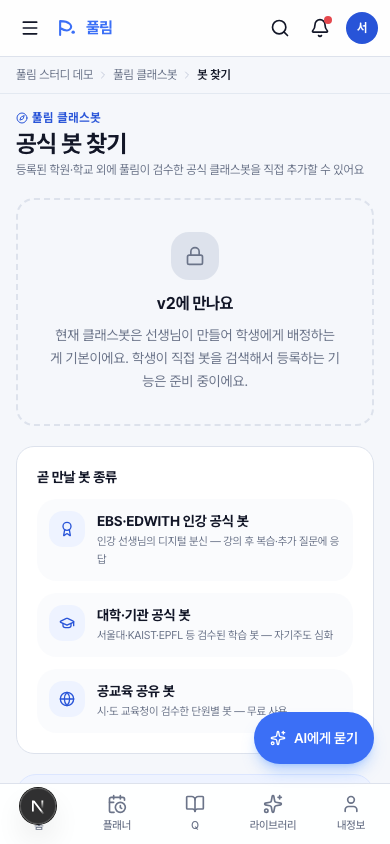

**역할** v2에서 학생이 자발 등록할 수 있는 공식 봇 마켓 자리. 현재는 locked future placeholder.

**핵심 영역**

- **Locked card** — "v2에 만나요" + 안내.
- **곧 만날 봇 종류** — EBS·EDWITH 인강 / 대학·기관 / 공교육 공유.
- **FlywheelNote** — "지금은 선생님이 배정한 봇만 사이드바에 등장…"

**수정 포인트** 실제 마켓 구현 시 `app/(student)/classbot/discover/page.tsx` 통째로 교체. nav-config의 `locked: true` 제거.

---

# 4. 교사 화면

## 4.1 `/teacher/classbot` — 내 클래스봇 (라이브 운영)

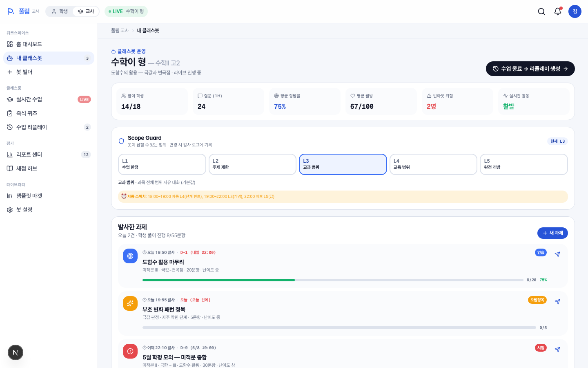

**역할** 진행 중인 라이브 수업의 메인 대시보드. 학생 상태 모니터링·Scope 통제·즉석 퀴즈·과제 발사·위기 신호 즉시 개입.

**핵심 영역**

- **상단 헤더** — 봇 이름·과목·라이브 상태 + "수업 종료 → 리플레이 생성" CTA (`/teacher/replay/rp_004`).
- **6 KPI** — 참여 학생·질문(1H)·평균 정답률·평균 웰빙·번아웃 위험·실시간 활동.
- **Scope Control** — L1~L5 가로 셀렉터 (변경 시 감사 로그 기록).
- **발사한 과제** — Assignment 3건 진행도·정답률 + "새 과제" CTA + 행별 "다시 발사" 버튼.
- **3-pane 메인** (lg+) — 학생 명단 + 5분 단위 활동 히트맵 / 라이브 봇 질문 피드 + 전체 공유 토글 / 즉석 퀴즈 분포 + 위기 신호 즉시 개입 카드.
- **FlywheelNote** — 데이터 환원 안내.

**컴포넌트** `app/(teacher)/teacher/classbot/page.tsx` · `ClassKpiBar`·`ScopeControl`·`StudentRoster`·`LiveFeedPanel`·`QuizLauncher`·`DispatchedAssignments`(같은 파일)

**데이터** `myClassBot` · `classRoster` · `liveFeed` · `currentQuiz` · `studentAssignments` · `classKpis`

**수정 포인트** "수업 종료" 동작은 PageHeader action `<Link href="/teacher/replay/rp_004">`. KPI 6개 변경은 `ClassKpiBar`. Scope 5단계는 `scopeMeta` (lib/mock/tutor.ts).

---

## 4.2 `/teacher/builder` — 봇 빌더 (8단계)

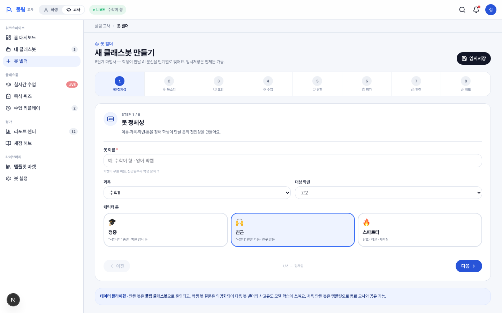

**역할** 새 클래스봇을 만드는 단일 진입 경로. 정체성·목소리·교안·수업방식·Scope·평가·안전·배포 8단계 위저드.

**핵심 영역**

- **StepIndicator** — 8단계 가로 표시, 점프 가능.
- **단계별 폼** — 좌측 입력, 우측 미리보기 (handoff 4.1).
- **임시저장 + 다음/이전 네비게이션**.
- **Step 6 (평가)** — 루브릭 합 100% 검증.
- **Step 8 (배포)** — 반 선택 → 학생 자동 enrollment 생성.

**컴포넌트** `app/(teacher)/teacher/builder/page.tsx` · `StepIndicator` · `StepContent`

**데이터** `BuilderState` (`builder-types.ts`)

**수정 포인트** 단계별 폼은 `step-content.tsx` 안의 분기 (각 step 컴포넌트). 새 단계 추가 시 `StepIndicator` 항목 + step component 추가.

---

## 4.3 `/teacher/live` — 실시간 수업 (멀티 봇)

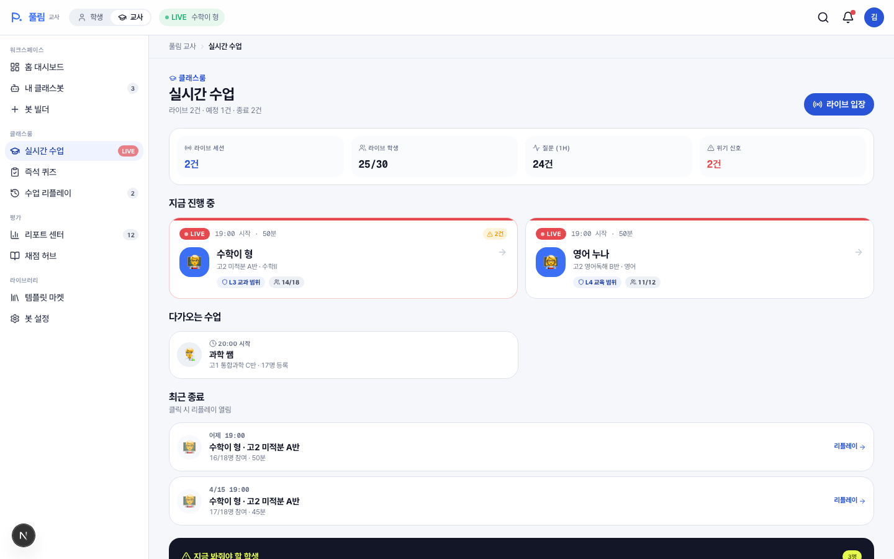

**역할** 교사가 운영하는 모든 라이브 세션을 한 페이지에서. 라이브·예정·종료 3 분류.

**핵심 영역**

- **상단 KPI** — 라이브 세션 / 라이브 학생 / 질문(1H) / 위기 신호.
- **LIVE — 지금 진행 중** — 큰 카드. 봇 아바타 + LIVE pulse + 알림 카운트 + 클릭 → `/teacher/classbot`.
- **다가오는 수업** — 시작 전 봇 카드.
- **최근 종료** — 클릭 → `/teacher/replay/{rp_id}` (검토 페이지).
- **즉시 개입 대상** — 다크 카드, 위기 학생 명단 + Wee센터 연결 CTA.

**컴포넌트** `app/(teacher)/teacher/live/page.tsx`

**데이터** `liveSessions` · `classRoster.alert` · `classKpis`

**수정 포인트** 종료 행 → 리플레이 매핑은 `EndedRow`의 `replayId` 분기. 멀티 봇 데이터는 `liveSessions[]`.

---

## 4.4 `/teacher/quiz` — 즉석 퀴즈

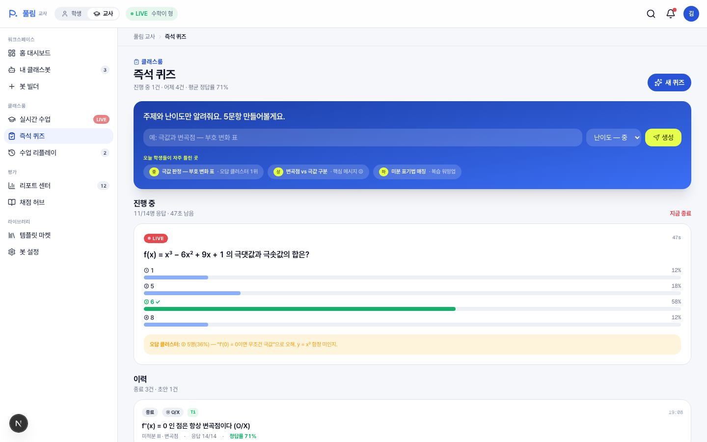

**역할** 30초 내 5문항 퀴즈 생성 + 라이브 응답 분포 + 오답 클러스터 + 이력.

**핵심 영역**

- **빠른 생성 hero** — 주제 한 줄 + 난이도 select + 생성 버튼. 오늘 학생 오답 클러스터 기반 추천 chip.
- **진행 중 (LIVE)** — 실시간 응답 분포 막대그래프 + 오답 클러스터링 코멘트.
- **이력** — 종료·초안 카드 (객관식·O/X·단답·매칭, Tier T1/T2 표시).
- **자주 쓰는 형식** — 객관식 5문항·라이브 폴·O/X 단원 점검·응답 상세 분포.

**컴포넌트** `app/(teacher)/teacher/quiz/page.tsx`

**데이터** `quizHistory` · `quizDrafts` · `currentQuiz`

**수정 포인트** 추천 chip 데이터는 `quizDrafts`. 생성 form은 hero 안 (현재 mock — 클릭 시 동작 없음).

---

## 4.5 `/teacher/reports` — 리포트 센터

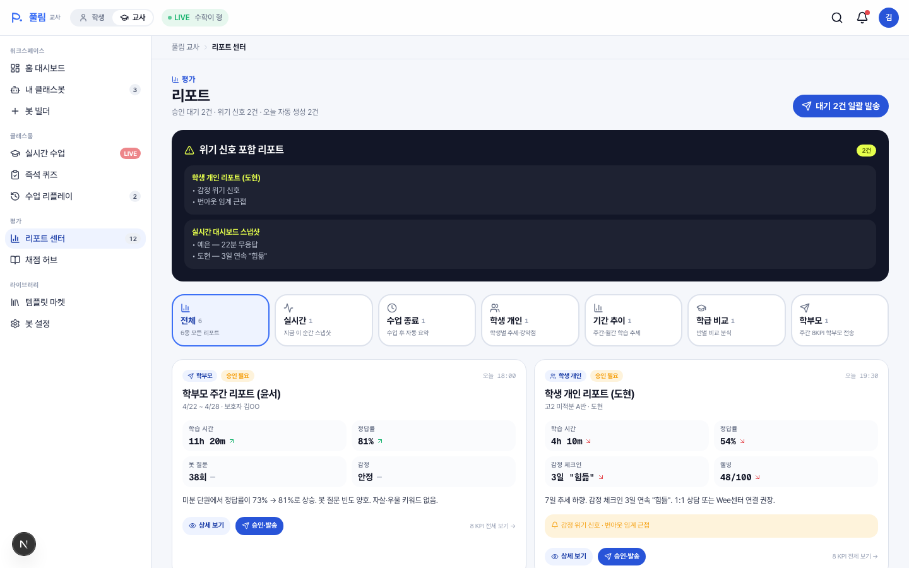

**역할** 6종 리포트 (실시간/수업종료/학생개인/기간추이/학급비교/학부모) 필터 + 위기 신호 우선.

**핵심 영역**

- **위기 신호 카드** (다크) — 알림 포함 리포트 우선 노출.
- **종류 필터 chip 7개** — 전체 + 6종.
- **리포트 카드** — 종류 배지·상태(승인 대기/완료/발송/초안)·KPI 4개·요약·액션(상세/승인·발송).

**컴포넌트** `app/(teacher)/teacher/reports/page.tsx` (use client) · `ReportCard`

**데이터** `reports` (6건)

**수정 포인트** 리포트 데이터·KPI는 `reports[]`. 종류·상태 메타는 `kindMeta`·`statusMeta`. 새 리포트 종류 추가 시 `ReportKind` union + `kindMeta` 추가.

---

## 4.6 `/teacher/grading` — 채점 허브

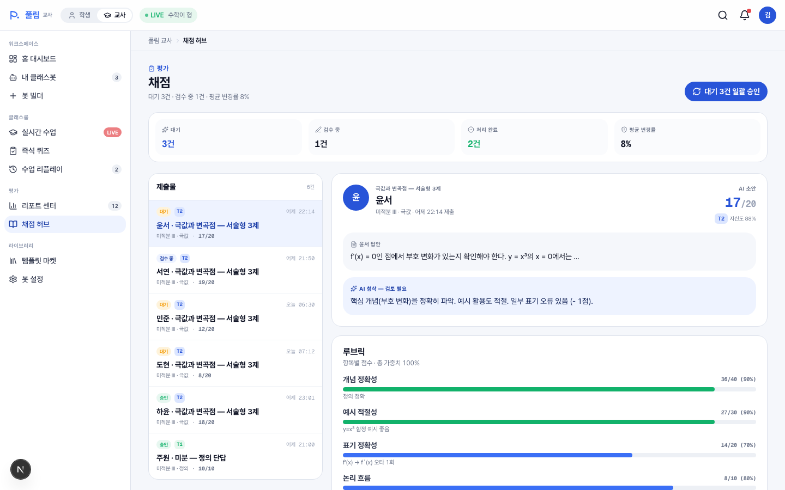

**역할** AI 초안 + 교사 검수. 객관식 즉시 (T1) / 서술형 초안 (T2) / 상위·하위 분석 (T3).

**핵심 영역**

- **상단 KPI** — 대기·검수 중·완료·평균 변경률.
- **루브릭 재학습 제안** (변경률 임계 초과 시) — 다음 과제부터 더 가깝게.
- **2-pane** (lg+) — 좌: 큐 리스트 (학생·과제·상태·Tier) / 우: 상세 — 학생 메타 + AI 초안 점수 / 학생 응답 / AI 코멘트 초안 / 위기 신호 ("점수보다 면담이 먼저") / 루브릭 항목별 점수 / 액션: 초안 승인 / 점수·코멘트 수정 / 다음 학생.

**컴포넌트** `app/(teacher)/teacher/grading/page.tsx` (use client) · `GradingDetail`

**데이터** `gradingQueue` · `gradingStats`

**수정 포인트** 큐 데이터는 `gradingQueue[]`. 임계값은 `gradingStats.rubricLearningThreshold`. 루브릭 항목은 각 grading item의 `rubric` 배열.

---

## 4.7 `/teacher/templates` — 템플릿 마켓

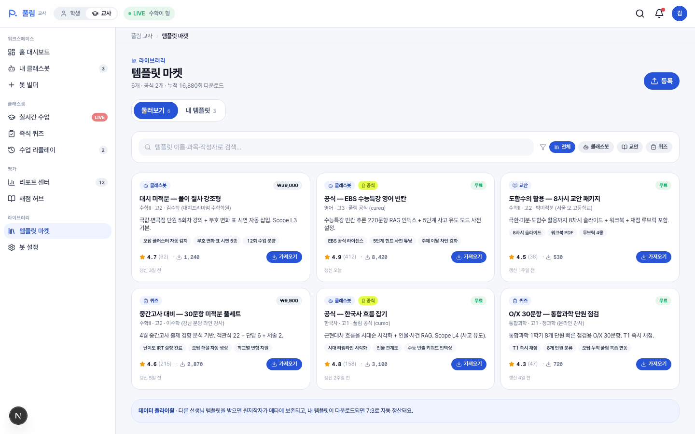

**역할** 동료 교사가 만든 봇·교안·퀴즈 공유. 둘러보기 / 내 템플릿 2탭. 7:3 정산.

**핵심 영역**

- **탭 토글** — 둘러보기 / 내 템플릿.
- **검색 + 필터 chip** — 전체·클래스봇·교안·퀴즈.
- **카드 그리드** — 종류 배지·공식 마크·가격·작성자·평점·다운로드·하이라이트 3개.
- **내 템플릿 (지표)** — 다운로드·누적 수익·공개 중. 7:3 정산 안내.

**컴포넌트** `app/(teacher)/teacher/templates/page.tsx` (use client) · `TemplateCard`

**데이터** `templates[6]` · `myTemplateUploads[3]`

**수정 포인트** 템플릿 데이터는 `templates[]`. 가격 표시는 `priceLabel` (free vs `{krw: number}`). 공식 마크는 `isOfficial: true`.

---

## 4.8 `/teacher/settings` — 봇 설정 (8탭)

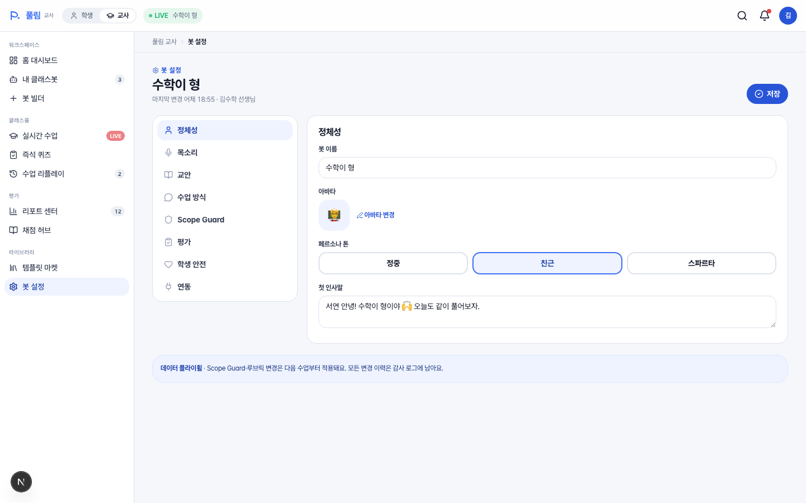

**역할** 클래스봇 운영 설정. 정체성·목소리·교안·수업방식·Scope·평가·안전·연동.

**핵심 영역**

- **상단 헤더** — 봇 이름 + 마지막 변경 메타.
- **좌측 탭 (lg sticky)** — 8개 탭 아이콘 + 라벨.
- **우측 콘텐츠** — 탭별 폼: 정체성 (이름·아바타·페르소나·인사말) / 목소리 (동의·프리셋·자동 삭제) / 교안 (3-Depth 분류·자료 인덱싱) / 수업 방식 (강의/토론/문제풀이/혼합 + 시간대별 자동 Scope) / Scope Guard (기본·시험 모드 + 감사 로그) / 평가 (루브릭·자동 피드백·재학습 임계) / 학생 안전 (개인정보·민감 차단·위기 키워드·만 14세 동의) / 연동 (구글 클래스룸·NEIS·카카오톡·Zoom).

**컴포넌트** `app/(teacher)/teacher/settings/page.tsx` (use client) · 탭별 `*Pane` 함수

**데이터** `botSettings` (BotSettingsState)

**수정 포인트** 새 탭 추가는 `tabs[]` + Pane 함수 + 분기 추가. 폼 항목은 각 Pane 안. 설정 데이터는 `botSettings`.

---

## 4.9 `/teacher/replay` — 수업 리플레이 큐

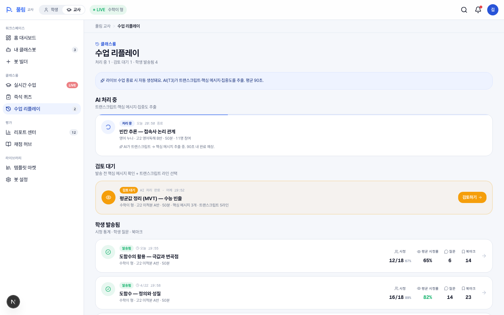

**역할** 수업 종료 → AI 자동 추출 → 교사 검토 → 학생 발송 흐름의 큐 페이지. 처리 중·검토 대기·발송됨 3 단계.

**핵심 영역**

- **자동 생성 안내** — "라이브 종료 시 자동 생성. 평균 90초."
- **AI 처리 중** — 진행 바 + 봇 메타 + "트랜스크립트 추출 중" (rp_004 영어 누나).
- **검토 대기** — 강조 카드 (warn 컬러 border + Eye 아이콘) + "검토하기" CTA (rp_005 평균값 정리).
- **학생 발송됨** — 시청 통계 (시청·평균 시청률·질문·북마크) + 클릭 → 검토 페이지.

**컴포넌트** `app/(teacher)/teacher/replay/page.tsx` · `ProcessingCard`·`ReviewCard`·`SentCard`

**데이터** `studentReplays.filter(r => r.status === ...)`

**수정 포인트** 상태별 카드는 각 `*Card` 함수. 자동 생성 안내 카피는 상단 aside. 학생 시청 통계 표시는 `SentCard`의 Mini.

---

## 4.10 `/teacher/replay/[id]` — 검토 (Review 상태)

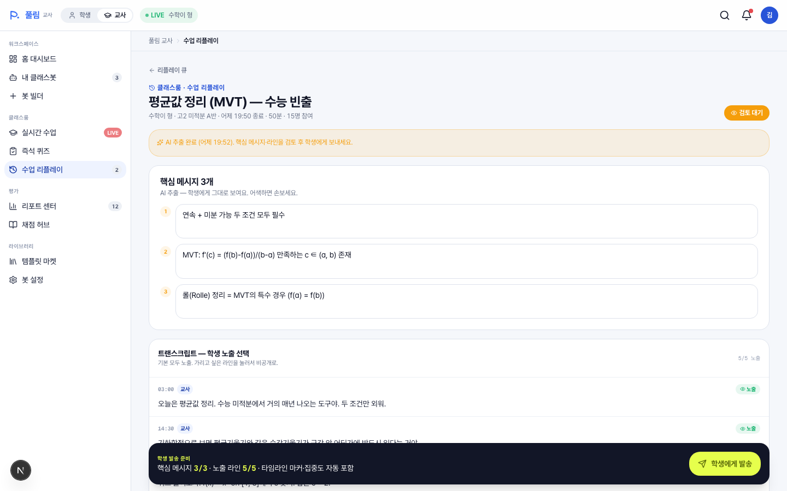

**역할** 학생 발송 전 AI 추출 결과를 교사가 검토·편집. 핵심 메시지 textarea + 트랜스크립트 라인 노출 토글 + 발송 승인 sticky bar.

**핵심 영역**

- **상태 배지** — "검토 대기" (warn) / "발송됨" (success) / "AI 처리 중".
- **상태 배너** — "AI 추출 완료. 핵심 메시지·라인을 검토 후 학생에게 보내세요."
- **핵심 메시지 3개 편집** — 1·2·3번 textarea (AI 추출 그대로, 편집 가능).
- **트랜스크립트 학생 노출 선택** — 라인별 클릭 시 토글. 비공개는 line-through 회색.
- **자동 추출 세그먼트** — 8개 (개념·퀴즈·내 질문·전체공유·집중도). read-only.
- **반 집중도 히트맵** — read-only preview.
- **발송 승인 바 (sticky bottom)** — "핵심 메시지 3/3 채워야 활성" + 큰 lemon CTA.

**컴포넌트** `components/classbot/replay-review.tsx` (use client) · 내부 sub-components

**데이터** `studentReplays[id]` 전체

**수정 포인트** 핵심 메시지 편집은 `KeyTakeawaysEditor`. 라인 토글 로직은 `TranscriptVisibility`. 발송 승인 동작 (현재 local state)은 `ApproveBar.onApprove`.

---

## 4.11 `/teacher/replay/[id]` — 발송됨 (Sent 상태)

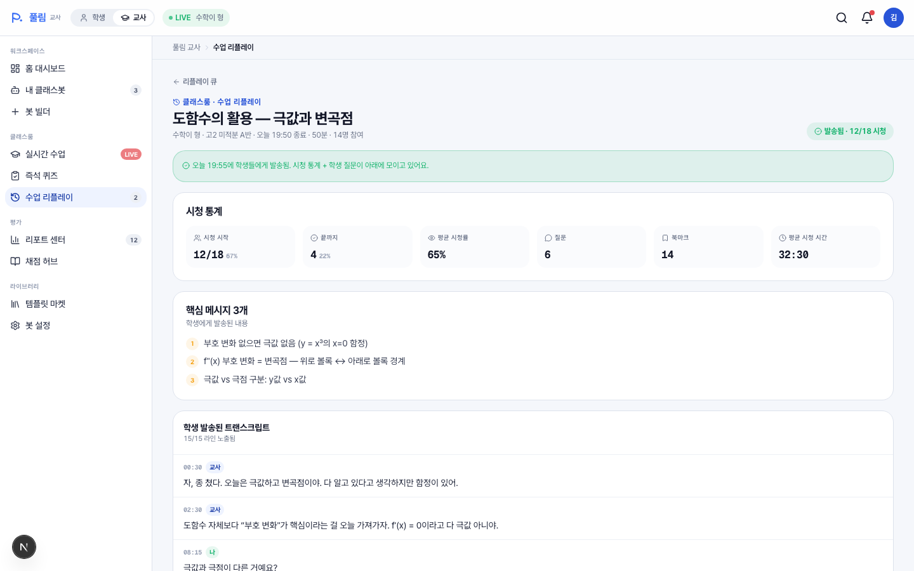

**역할** 학생에게 이미 발송된 리플레이의 시청 통계·학생 활동 사후 분석.

**핵심 영역**

- **상태 배지** — "발송됨 12/18 시청" (success).
- **Sent 배너** — "오늘 19:55에 발송됨. 시청 통계 + 학생 질문이 모이고 있어요."
- **시청 통계 6 KPI** — 시청 시작·끝까지·평균 시청률·질문·북마크·평균 시청 시간.
- **핵심 메시지 (read-only)** — 발송된 내용 그대로.
- **트랜스크립트 (read-only, 노출된 라인만)** — N/N 라인 노출.

**컴포넌트** 같은 `replay-review.tsx`, status 분기.

**수정 포인트** 시청 통계 추가 항목은 `ViewerStatsPane`. 통계 데이터는 `Replay.viewerStats`.

---

## 4.12 `/teacher/replay/[id]` — 처리 중 (Processing 상태)

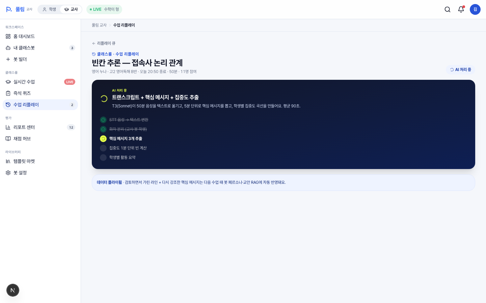

**역할** AI(T3)가 트랜스크립트·핵심 메시지·집중도 추출 중인 단계의 시각화.

**핵심 영역**

- **상태 배지** — "AI 처리 중" (animate-spin).
- **ProcessingPane (다크)** — 큰 카드. "T3(Sonnet)이 50분 음성을 텍스트로 옮기고…" + 5단계 진행 표시 (STT 음성 변환 / 화자 분리 / 핵심 메시지 추출 / 집중도 빈 / 학생별 활동 요약).

**컴포넌트** 같은 `replay-review.tsx` · `ProcessingPane`·`ProcessStep`

**수정 포인트** 진행 단계 라벨은 `ProcessingPane` 안의 `<ProcessStep>` 5개. 완료 자동 전환은 backend 연결 후 구현.

---

# 5. 컴포넌트 명세 (재사용)

| 컴포넌트 | 파일 | 어디서 쓰나 | 역할 |
|---|---|---|---|
| `ReplayPlayer` | `components/classbot/replay-player.tsx` | 학생 `/classbot/replay/[id]` | 50분 수업 진짜 재생 |
| `ReplayReview` | `components/classbot/replay-review.tsx` | 교사 `/teacher/replay/[id]` | 검토·편집·발송 |
| `BotHeader` | `components/classbot/bot-header.tsx` | 학생 시그니처 | 봇 정체성 헤더 |
| `ClassKpiBar` | `components/classbot/class-kpi-bar.tsx` | 교사 라이브 | 6 KPI |
| `ScopeControl` | `components/classbot/scope-control.tsx` | 교사 라이브 | L1~L5 셀렉터 |
| `StudentRoster` | `components/classbot/student-roster.tsx` | 교사 라이브 | 학생 명단 + 활동 히트맵 |
| `LiveFeedPanel` | `components/classbot/live-feed-panel.tsx` | 교사 라이브 | 봇 질문 피드 |
| `QuizLauncher` | `components/classbot/quiz-launcher.tsx` | 교사 라이브 | 즉석 퀴즈 분포 |
| `LiveQuizCard` | `components/classbot/live-quiz-card.tsx` | 학생 홈 | 라이브 퀴즈 응답 |
| `StepIndicator` | `components/builder/step-indicator.tsx` | 교사 빌더 | 8단계 위저드 |
| `StepContent` | `components/builder/step-content.tsx` | 교사 빌더 | 단계별 폼 |

공유 컴포넌트(편집 시 글로벌 작업): PageHeader·SectionHeading·FlywheelNote·SectionIntro·AppShell·AppHeader·AppSidebar·BottomNav.

---

# 6. Mock 데이터 인덱스

`lib/mock/classbot.ts`에 모든 클래스봇 도메인 데이터가 모여 있음.

| Mock | 무엇 | 어디서 |
|---|---|---|
| `classBots[3]` | 수학이 형·영어 누나·과학 쌤 마스터 | 학생 홈, 채팅, 리플레이 필터, 교사 모든 화면 |
| `studentEnrollments[3]` | 서연이 등록된 봇 + 반 메타 | 학생 홈 카드 |
| `studentAssignments[3]` | 오늘 풀어야 할 과제 | 학생 홈 hero·받은 과제·교사 발사한 과제 |
| `classRoster[18]` | 한 반 학생 명단 + 실시간 상태 | 교사 학생 명단·위기 신호 |
| `liveFeed[5]` | 라이브 봇 질문 피드 | 교사 라이브 |
| `currentQuiz` | 진행 중 퀴즈 1건 | 학생/교사 라이브 |
| `quizHistory[5]` | 퀴즈 이력 | 교사 즉석 퀴즈 |
| `quizDrafts[3]` | AI 추천 퀴즈 초안 | 교사 즉석 퀴즈 |
| `liveSessions[5]` | 멀티 봇 라이브/예정/종료 | 교사 실시간 수업 |
| `reports[6]` | 6종 리포트 카드 | 교사 리포트 센터 |
| `gradingQueue[6]` | 채점 대기·검수·완료 | 교사 채점 |
| `gradingStats` | 평균 변경률·임계 | 교사 채점 |
| `templates[6]` | 마켓 템플릿 | 교사 템플릿 마켓 |
| `myTemplateUploads[3]` | 내가 등록한 템플릿 | 교사 템플릿 마켓 |
| `botSettings` | 봇 설정 8 카테고리 | 교사 봇 설정 |
| `studentReplays[5]` | 리플레이 (sent 4 + processing 1 + review 1) | 학생 (sent만)·교사 (전체) |

**Helper** `getMyBots()`·`getLiveBots()`·`getSentReplays()`·`pickPrimaryAssignment()`·`formatReplayTime()`

---

# 7. 향후 작업 후보

| | 무엇 | 크기 | 트리거 |
|---|---|---|---|
| A | 학생 자발 등록 — `/classbot/discover` 실제 마켓 | 대 | v2 출시 |
| B | 교사 멀티봇 운영 — `/teacher/classbot`을 N개 봇 운영 화면으로 | 중 | 첫 학원 멀티봇 운영자 인입 |
| C | 빌더 8단계 마지막 "배포" — 진짜 enrollment 생성 흐름 | 중 | 빌더 수정 |
| D | 리플레이 처리 → 검토 → 발송 자동 진행 시뮬 | 소 | 데모 폴리시 |
| E | Onboarding 4분 가이드 콘텐츠 | 소 | 학생/교사 첫 진입 UX |

---

> 문의·변경 제안은 풀림 클래스봇 도메인 락인 작업으로 진행 (CLAUDE.md §3 참조).
