# 풀림 Q · 화면 스토리보드 + 기능 명세서

> **버전** v1.0 · **작성일** 2026-04-30 · **대상** 풀림 Q 도메인 (학생 영역)
> **사용 환경** Next.js 16.2.4 (Turbopack) · React 19.2.4 · Tailwind v4 · shadcn/ui
> **데모 URL** http://localhost:3030

---

## Part 1 — 도메인 개요

### 1.1 풀림 Q는 무엇인가

풀림 Q는 학생이 **문제를 풀고, 막히면 묻고, 실력을 분석하고, 잊지 않게 복습하는** 통합 엔진이다. 학습 사이클의 한 곳으로, 4 서브도메인이 자연스럽게 흐른다.

기획 문서: `docs/03_풀림_스터디_마스터.md` · `docs/09_풀림_Q_핸드오프.md`

### 1.2 4 서브도메인 + 허브

| 영역 | 라우트 | 역할 |
|---|---|---|
| **풀림 Q 허브** | `/q` | 오늘 학습 한눈에 — D-day, 시급 액션, 풀이 큐, 이번 주 변화, 다가오는 일정 |
| **무한풀기** | `/q/infinity/*` | 적응형 풀이 + 모의고사 + 풀림 해설 12-섹션 + AI 코치 |
| **코치** | `/q/talk` | 공부 전반을 봐주는 AI 친구 — 통합 메시지 + 채팅 + 활동 타임라인 |
| **분석** | `/q/analysis/*` | 능력치(IRT θ) + 과정(메타인지) + 진단 |
| **복습** | `/q/review/*` | 오답 정복(Leitner 5-Box) + 망각 곡선 + 정복 세트 |
| **소개하기** | `/q/onboarding` | 풀림 Q 5분 가이드 |

### 1.3 데이터 흐름 (Q ↔ Planner)

| 흐름 | 방향 | 의미 |
|---|---|---|
| 시간표 일정 | **Planner 소유** | 블록 배치·NEXT BLOCK·시간 단위 스케줄은 풀림 플래너 책임 |
| 오답 자동 복습 블록 | Q → Planner | 오답 발생 → 자동 Leitner + 플래너 보강 블록 생성 |
| 약점 처방 블록 | Q → Planner | 분석 결과 → 자동 취약 보강 블록 |
| 풀이 진입점 | Planner → Q | 플래너 블록 → `/q/infinity/solve?block=<id>` 딥링크 |
| 실력 점수 환류 | Q 내부 | 풀이 로그 → IRT θ 갱신 → 분석 능력치 → 처방 |
| 망각 곡선 알림 | Q 내부 | 풀이·해설 학습 → 개인 망각 모델 → 복습 큐 |

### 1.4 락인 컨벤션 — 수정 범위 정의

`web/CLAUDE.md`에 정의된 6 도메인 중 **풀림 Q** 락인 범위:

```
편집 자유 (Q 락인 안):
  app/(student)/q/{infinity,talk,analysis,review,onboarding}/
  app/(student)/q/page.tsx
  components/{infinity,coach,tutor,conqueror,memory,study-index,xray}/
  lib/mock/{infinity,coach,tutor,conqueror,memory,irt,xray}.ts

읽기 자유 (orchestration 참조):
  app/(student)/{planner,classbot,library,...}/  (다른 도메인)
  components/shell/*  (공유 셸)
  lib/mock/{planner,classbot,visual,features,domains,persona,curriculum}.ts
  docs/0X_풀림_*_핸드오프.md

편집 시 사용자 명시 확인 필요 (글로벌 작업):
  components/shell/nav-config.ts
  lib/mock/{features,domains}.ts
  app/layout.tsx, package.json, next.config.ts
```

---

## Part 2 — 화면 스토리보드

각 화면은 **스크린샷 + URL + 역할 + 핵심 컴포넌트 + 주요 인터랙션 + mock 의존성** 순서로 정리한다.

### 2.1 풀림 Q 허브

#### S1 · `/q` — 오늘 풀이 한눈에 (액션 대시보드)

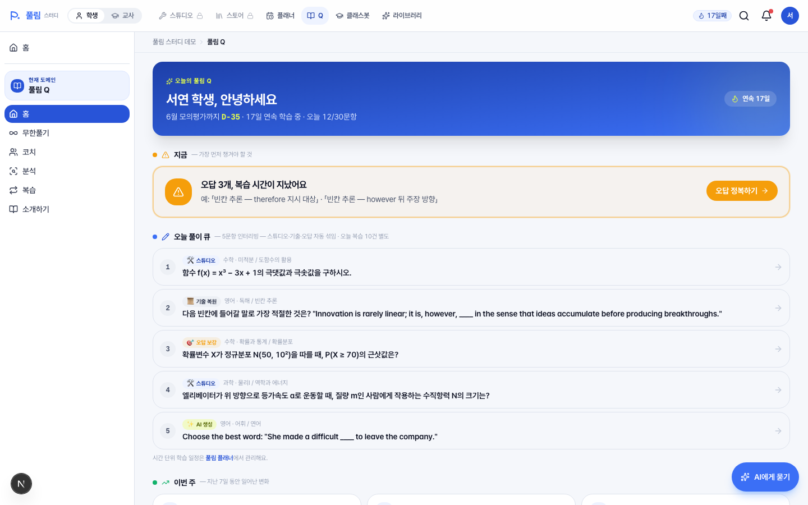

- **책임 파일** `web/app/(student)/q/page.tsx`
- **역할** "지금 무엇을 해야 하는지" 시간축 6 섹션으로 노출. 학생이 할 일을 페이지가 알려주는 dashboard.
- **핵심 섹션** (위→아래)
  1. D-day Hero — 페르소나 인사 + 시험까지 D-day + 연속 학습일
  2. **지금** — 시급 액션 1순위 (overdue 오답 / 망각 due / 약점 처방 자동 선택)
  3. **오늘 풀이 큐** — 5문항 인터리빙 (스튜디오·기출·오답·AI 생성 자동 섞임)
  4. **이번 주** — θ 변화 / 패턴 정복 / 마스터 임박
  5. **다가오는** — 지난 시험 결과 / D-day / 진단 추천
  6. **더 깊이** — 시그니처 풀림 해설 추천 3개
- **mock 의존성** `currentPersona`, `getDday()`, `overdueCards()`, `dueItems()`, `prescriptions`, `solveDeck`, `thetaTrend`, `conquestStats`, `leitnerCards`, `lastExamResult`, `lastDiagnosis`, `explainLibrary`
- **시간표 일정 X** — 플래너 일정은 표시하지 않음 (풀림 플래너 책임). 섹션 하단에 "시간 단위 일정은 풀림 플래너에서" 명시.

---

#### S2 · `/q/onboarding` — 풀림 Q 처음이라면 (4분 가이드)

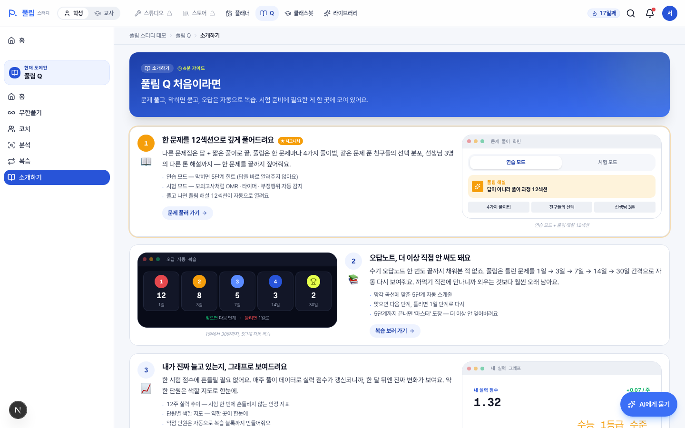

- **책임 파일** `web/app/(student)/q/onboarding/page.tsx`
- **역할** Q 첫 진입 학생용 4-step 가이드. 학생 상황(시나리오) 중심 카피.
- **4 step**
  1. ★ "한 문제를 12섹션으로 깊게 풀어드려요" (시그니처 풀림 해설)
  2. "오답노트, 더 이상 직접 안 써도 돼요" (자동 복습)
  3. "내가 진짜 늘고 있는지, 그래프로 보여드려요" (분석)
  4. "막힐 땐 AI가 옆에 있어요" (코치 + 무한풀기 옆 패널)
- **공통 컴포넌트** `OnboardingTemplate`, `MockBrowser`
- **CTA 모두 실제 기능 페이지로 직진** (`/q/infinity`, `/q/review`, `/q/analysis`, `/q/talk`)

---

### 2.2 풀림 무한풀기

#### S3 · `/q/infinity` — 무한풀기 홈

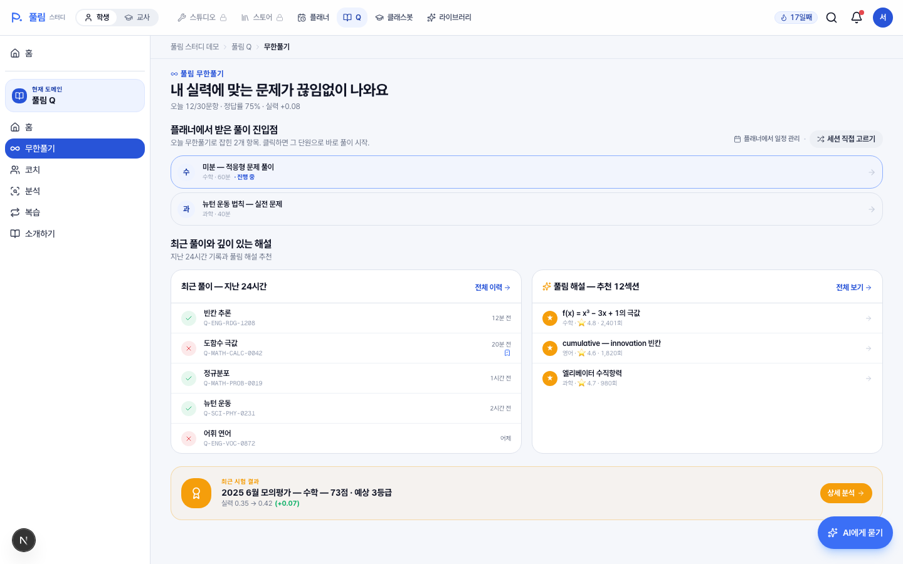

- **책임 파일** `web/app/(student)/q/infinity/page.tsx`
- **역할** 풀이 진입의 시작점. 플래너에서 받은 풀이 일정 + 최근 풀이 + 풀림 해설 추천 + 최근 시험 결과.
- **3 섹션**
  1. **플래너에서 받은 풀이 진입점** — `todayBlocks` 중 `linkedFeatureSlug='infinity'` 필터링. 컴팩트 리스트 (시간표 mimicry 회피). 헤더에 "📅 플래너에서 일정 관리" 링크 명시.
  2. **최근 풀이와 깊이 있는 해설** — 24시간 풀이 이력 + 시그니처 해설 추천
  3. **최근 시험 결과** — 점수·등급·θ 변화
- **데이터 흐름** 카드 클릭 → `/q/infinity/solve?block=<id>` 딥링크

---

#### S4 · `/q/infinity/solve` (picker) — 세션 선택

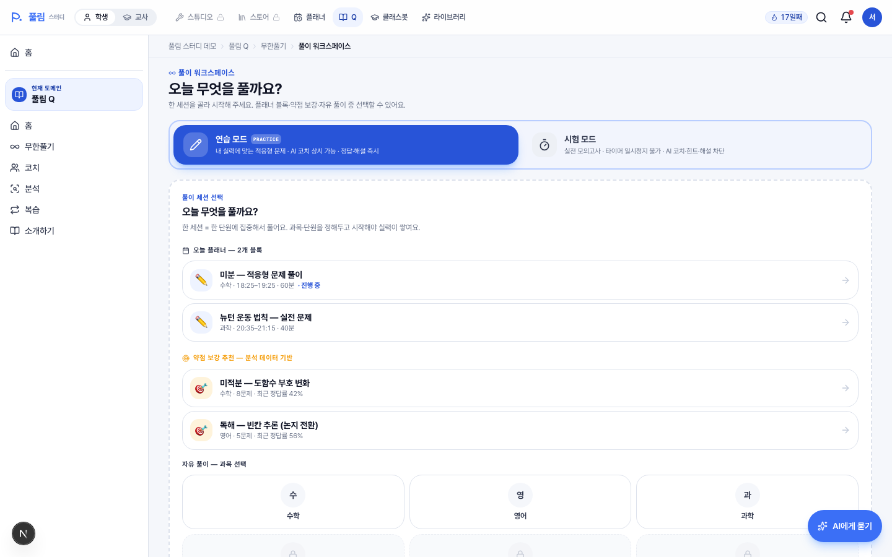

- **책임 파일** `web/app/(student)/q/infinity/solve/page.tsx` + `components/infinity/solve-session-picker.tsx`
- **역할** 학생이 URL 파라미터 없이 들어왔을 때 "오늘 무엇을 풀까?" 결정 강제.
- **3가지 세션 옵션**
  - 오늘 플래너 블록 list — 클릭 → `?block=<id>`
  - 약점 보강 추천 — `?kind=weak&subject=<X>&pattern=<Y>`
  - 자유 풀이 (과목 선택) — `?kind=free&subject=<X>` (math/english/science 활성, 국어/사회/한국사 잠금)

---

#### S5 · `/q/infinity/solve?block=b3` — 활성 세션 (워크스페이스)

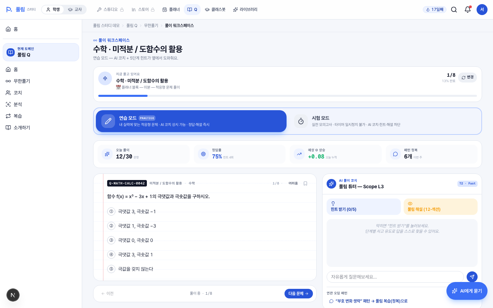

- **책임 파일** `web/app/(student)/q/infinity/solve/page.tsx` + `components/infinity/{solve-session-bar, problem-display, coach-pane, ...}.tsx`
- **역할** 풀이 워크스페이스. URL이 단일 진실 원천 — 세션은 URL 파라미터로 주입.
- **상단 컨텍스트 바** (`SolveSessionBar`)
  - 과목 + 단원 (예: "수학 · 미적분 / 도함수의 활용")
  - 출처 (📅 플래너 / 🎯 약점 보강 / 🔓 자유 풀이)
  - 진행률 N/total + % 완료
  - 변경 버튼 → picker로 복귀
- **모드 토글** 연습 / 시험 (시험 누르면 `ExamConfirmDialog` — 현재 세션 과목으로 시험 세트 자동 필터링)
- **연습 모드** 좌측 ProblemDisplay + 우측 CoachPane (5단계 힌트 + 풀림 해설 + 자유 입력)
- **AI 코치** — 힌트 사용량은 문제별 (sku 키)로 부모(solve page)에 보존. 다음 문제 0/5, 이전 문제 돌아가도 그대로.

---

#### S6 · `/q/infinity/explain` — 풀림 해설 라이브러리

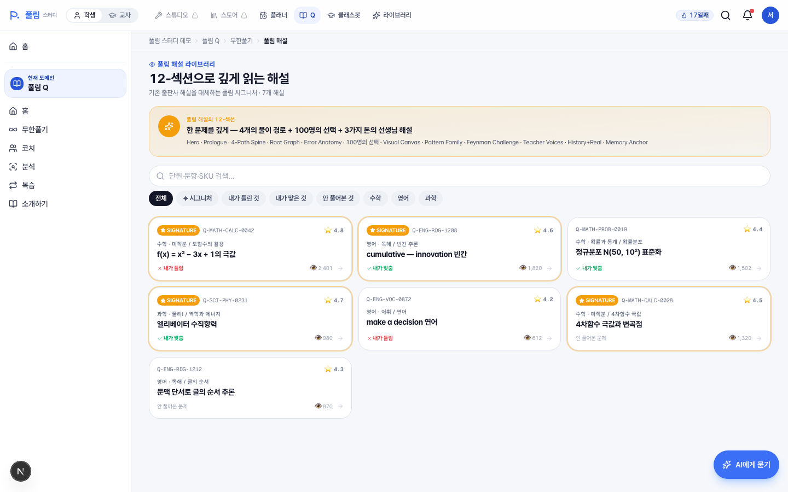

- **책임 파일** `web/app/(student)/q/infinity/explain/page.tsx`
- **역할** 시그니처 12-섹션 해설 모음. 과목별·단원별 검색·필터.
- **12 섹션** Hero Recap · Prologue · 4-Path Solution Spine ★ · Textbook Root Graph · Error Anatomy · 100명의 선택 · Visual Canvas · Pattern Family · Feynman Challenge · Teacher Voices · History+Real-World · Memory Anchor

---

#### S7 · `/q/infinity/exam-result` — 시험 결과

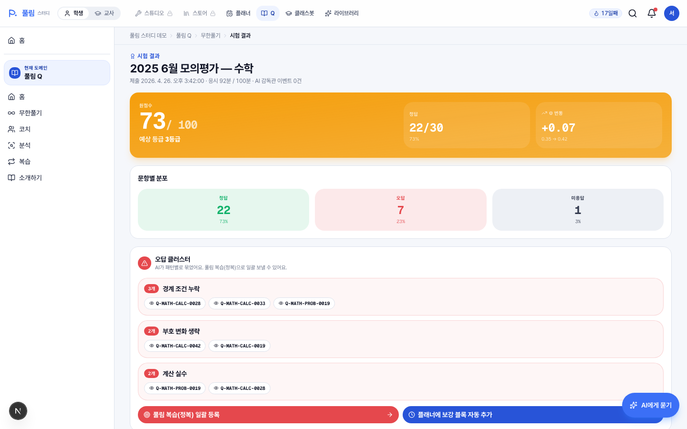

- **책임 파일** `web/app/(student)/q/infinity/exam-result/page.tsx`
- **역할** 모의고사 제출 후 채점·오답 클러스터·다음 액션 카드 표시.
- **mock 데이터** `lastExamResult` (점수 73, 등급 3, θ 0.35→0.42)

---

#### S8 · `/q/infinity/history` — 풀이 이력

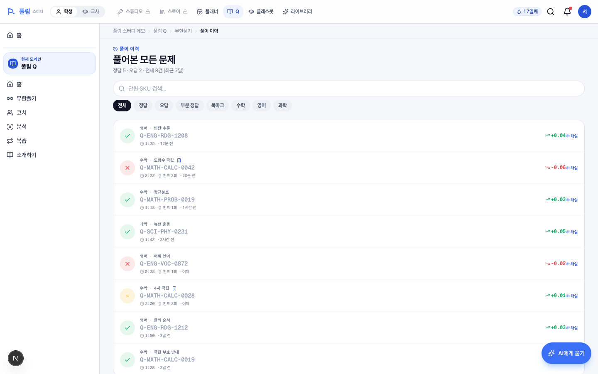

- **책임 파일** `web/app/(student)/q/infinity/history/page.tsx`
- **역할** 풀어본 문제 + 북마크 + 필터 (정답/오답/단원/시간).

---

#### S9 · `/q/infinity/onboarding` — 무한풀기 가이드

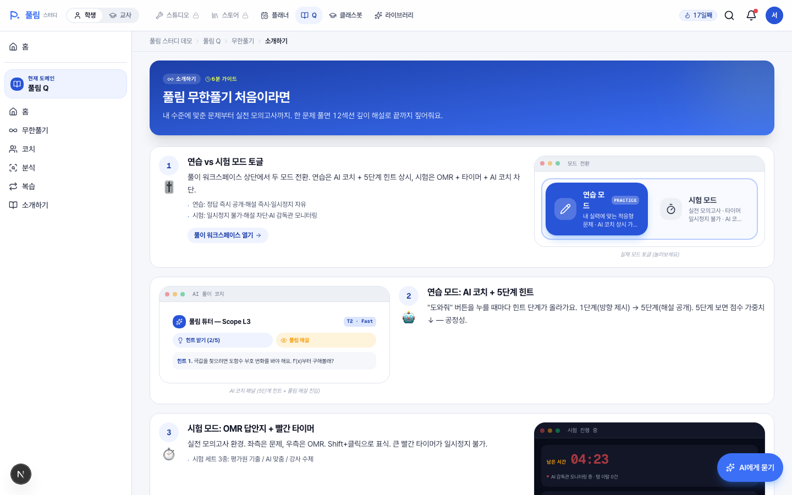

- **책임 파일** `web/app/(student)/q/infinity/onboarding/page.tsx`
- **5 step** 모드 토글 / 연습 모드(AI 코치) / 시험 모드(OMR) / 풀림 해설 12-섹션 ★ / 시험 결과·이력
- **추정 시간** 6분

---

### 2.3 풀림 코치

#### S10 · `/q/talk` — 공부 전반을 봐주는 친구

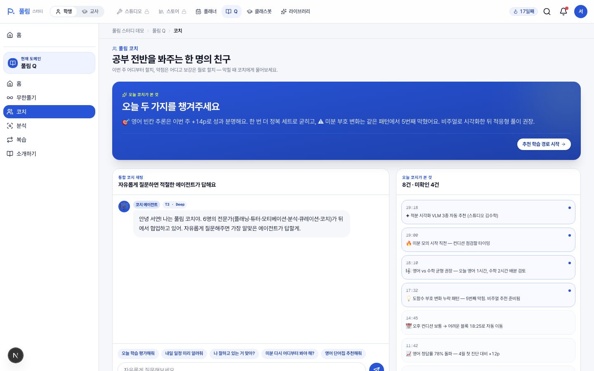

- **책임 파일** `web/app/(student)/q/talk/page.tsx`
- **역할** "한 문제 막혔다"는 무한풀기 옆 패널, "공부 전반 막혔다"는 여기. 별도 페이지 단일 메뉴.
- **3 섹션**
  - `CoachHero` — "오늘 코치가 본 것" 통합 메시지 (analysis/tutor/curation/planning 신호 종합)
  - `CoachChat` — 자유 채팅
  - `ActivityTimeline` — 오늘 발생한 학습 이벤트 (시간순)
- **메뉴 단순화** 이전 6 에이전트 그리드 + 튜터 별도 페이지 → 코치 단독으로 정리. 학생에게 architecture 노출 X.

---

#### S11 · `/q/talk/onboarding` — 코치 가이드

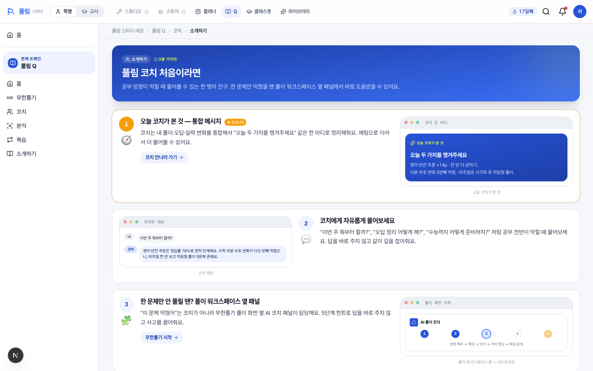

- **책임 파일** `web/app/(student)/q/talk/onboarding/page.tsx`
- **3 step** 통합 메시지 / 자유 채팅 예시 / "한 문제는 솔브 옆 패널" 안내

---

### 2.4 풀림 분석

#### S12 · `/q/analysis` — 분석 홈

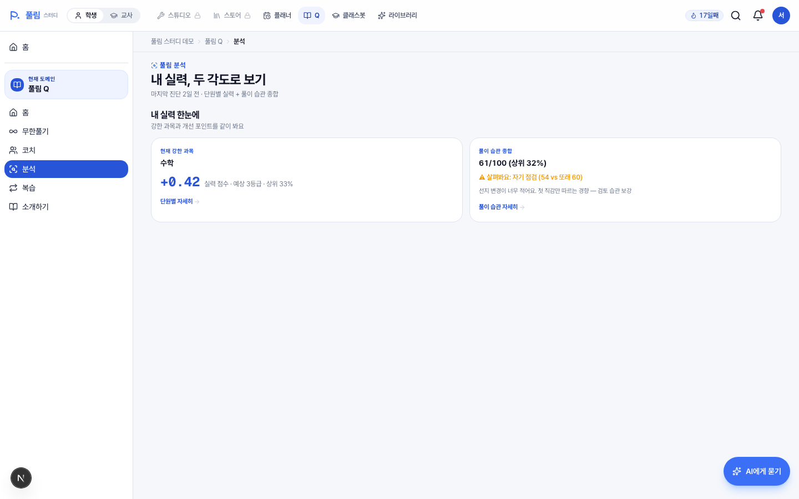

- **책임 파일** `web/app/(student)/q/analysis/page.tsx`
- **역할** "현재 강한 과목" + "풀이 습관 종합" 두 카드. 각각 ability·process 페이지 진입.
- **mock** `myAbility` (top), `metaDimensions`, `overallMeta`

---

#### S13 · `/q/analysis/ability` — 능력치 (IRT θ)

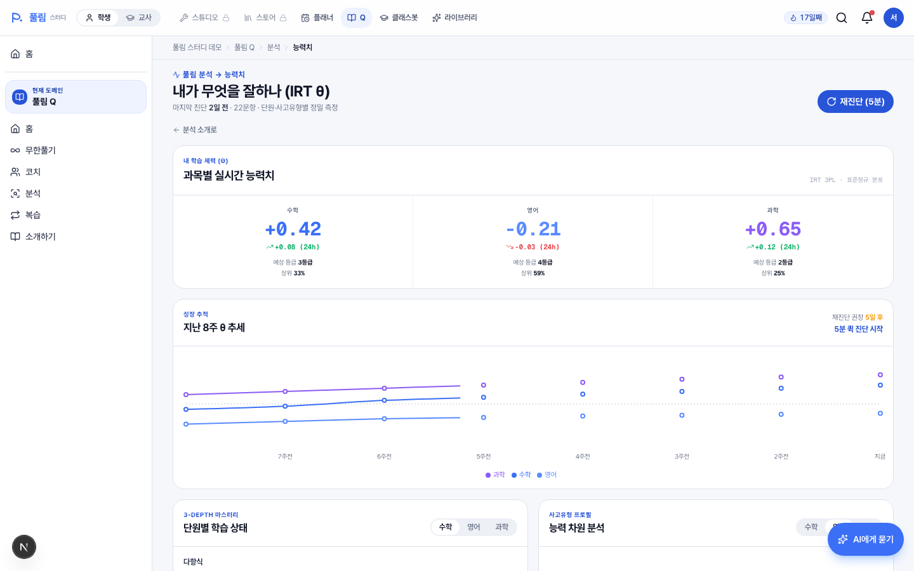

- **책임 파일** `web/app/(student)/q/analysis/ability/page.tsx`
- **역할** 단원별 마스터리 + 사고유형 레이더 + 약점 처방 4종.
- **컴포넌트** `AbilityHero`, `MasteryHeatmap`, `CognitiveRadar`, `GrowthTrend`, `PrescriptionList`
- **재진단 CTA** 우상단 — `/q/analysis/diagnose`로 진입

---

#### S14 · `/q/analysis/process` — 과정 (메타인지)

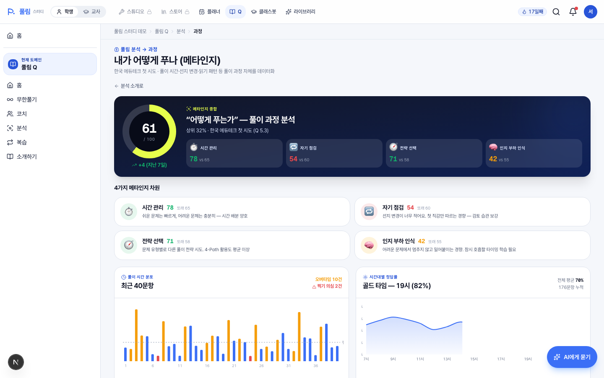

- **책임 파일** `web/app/(student)/q/analysis/process/page.tsx`
- **역할** 풀이 시간 분포 / 시간대별 정답률 / 찍기 탐지 / 메타인지 4차원 / 다음 액션.
- **컴포넌트** `MetaHero`, `MetaDetailCards`, `TimeDistributionChart`, `HourlyAccuracyChart`, `GuessingDetector`, `MetaCognitionReport`, `ActionSuggestions`

---

#### S15 · `/q/analysis/diagnose` — 진단 시작

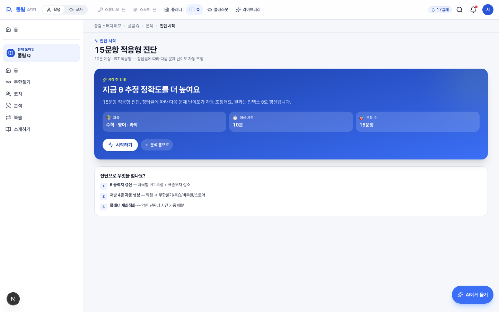

- **책임 파일** `web/app/(student)/q/analysis/diagnose/page.tsx`
- **역할** 15문항 IRT 적응형 진단 (5분 소요). 결과 → 능력치 갱신 + 처방 생성.

---

#### S16 · `/q/analysis/onboarding` — 분석 가이드

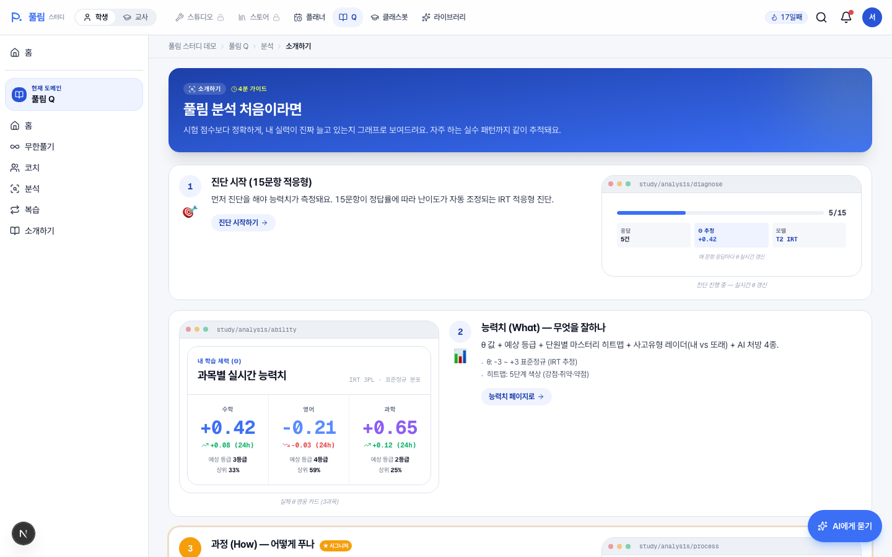

- **책임 파일** `web/app/(student)/q/analysis/onboarding/page.tsx`
- **추정 시간** 4분. 진단 → 능력치 → 과정 → 처방 흐름 안내.

---

### 2.5 풀림 복습

#### S17 · `/q/review` — 복습 홈

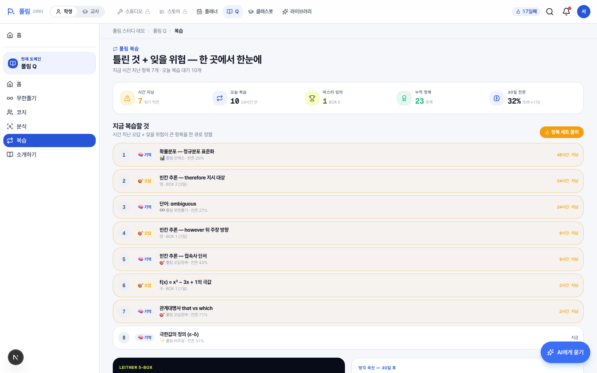

- **책임 파일** `web/app/(student)/q/review/page.tsx`
- **역할** "틀린 문제" + "배운 것 기억" 두 묶음 카드.
- **mock** `overdueCards`, `todayCards`, `dueItems`, `personalForgettingProfile`, `conquestStats`

---

#### S18 · `/q/review/wrong` — 틀린 것 (Leitner 5-Box)


- **책임 파일** `web/app/(student)/q/review/wrong/page.tsx`
- **역할** 5박스 자동 스케줄 (1·3·7·14·30일). 에러 패턴 TOP 5 + 정복 통계.
- **컴포넌트** `ConquestHero`, `LeitnerBoxes`, `ErrorPatternList`, `ConquestList`

---

#### S19 · `/q/review/all` — 모든 학습 (망각 곡선)


- **책임 파일** `web/app/(student)/q/review/all/page.tsx`
- **역할** 개인 망각 곡선 + 4종 복습 형태(플래시카드·빈칸·객관식·AI 변형) + 크로스앱 타임라인.
- **컴포넌트** `ForgettingCurveChart`, `ReviewQueue`, `ReviewFormats`, `CrossAppTimeline`

---

#### S20 · `/q/review/conquer` — 정복 세트 풀이

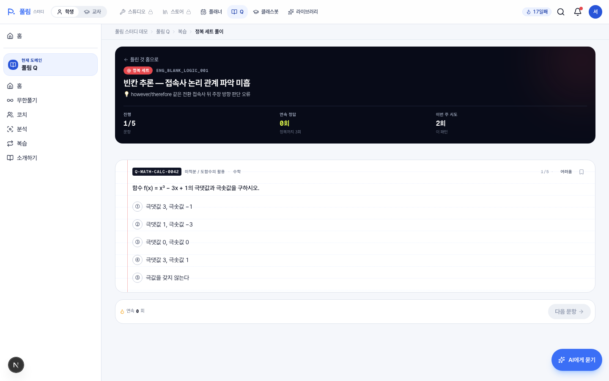

- **책임 파일** `web/app/(student)/q/review/conquer/page.tsx`
- **역할** 패턴 맞춤 5문제 (다크 워크룸). 3회 연속 정답 → 정복 스탬프.

---

#### S21 · `/q/review/onboarding` — 복습 가이드

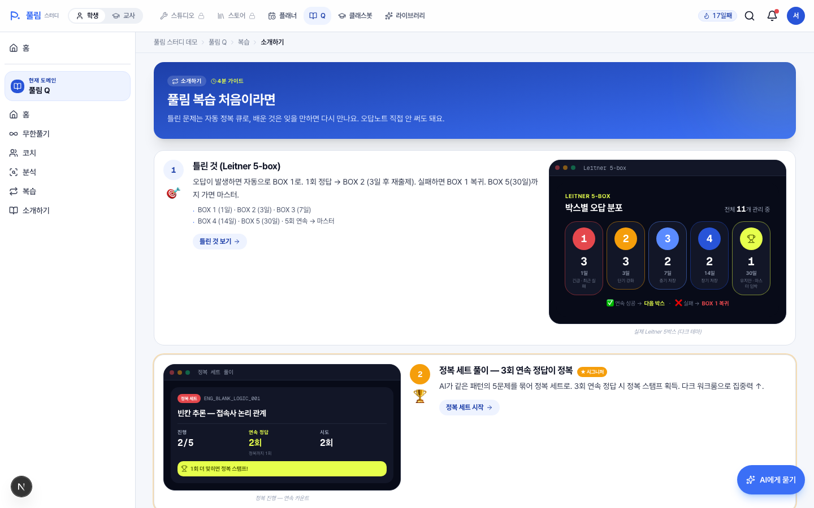

- **책임 파일** `web/app/(student)/q/review/onboarding/page.tsx`
- **3-4 step** 5박스 자동 / 망각 곡선 / 4종 형태 / 마스터 도장

---

## Part 3 — 기능 명세서

각 기능은 **수정 단위**로 끊어 정의한다. 기능 ID로 변경 요청을 받으면 책임 파일 + 의존성 + 체크리스트를 따라 작업한다.

---

### F1 · NowAction (시급 액션 우선순위)

- **위치** `web/app/(student)/q/page.tsx:25-37` (`pickNowAction()`)
- **역할** Q 허브 "지금" 섹션에 표시할 단일 hero card 결정.
- **우선순위 (현재)**
  1. `leitner_overdue` — 오답 복습 시간 지난 카드 있으면
  2. `memory_overdue` — 망각 곡선 due 항목
  3. `prescription` — priority=1 약점 처방
  4. `free` — fallback ("자유 풀이")
- **입력** `overdueCards()`, `dueItems()`, `prescriptions`
- **출력** `NowAction` discriminated union → `<NowCard>` 렌더
- **변경 시 체크리스트**
  - [ ] 우선순위 변경 시 `pickNowAction()`만 수정 (UI는 NowCard에서 분기)
  - [ ] 새 kind 추가 시 NowAction type 확장 + NowCard에 case 추가
  - [ ] CTA href는 channelHrefMap에 의존 (분석 처방 채널)

---

### F2 · 오늘 풀이 큐 (인터리빙 5문항)

- **위치** `web/app/(student)/q/page.tsx:46-49` (`todayQueue()`) + `TodayQueueSection`
- **역할** Q 허브에 시간 단위가 아닌 **문항 단위** 큐 표시 (시간표는 플래너 책임).
- **데이터 출처** `solveDeck` 5개 + 인라인 출처 라벨 (스튜디오/기출/오답/스튜디오/AI)
- **출처 색상 매핑** `queueSourceMeta` (page.tsx 내)
- **CTA** 각 문항 → `/q/infinity/solve?kind=free&subject=<subject>`
- **변경 시 체크리스트**
  - [ ] solveDeck 확장 시 todayQueue 5개 슬라이스 유지
  - [ ] 출처 분포 변경 → `sources` 배열 수정
  - [ ] 큐 길이 변경 시 페이지 레이아웃 재확인

---

### F3 · 무한풀기 솔브 — 세션 컨텍스트 (URL 라우팅)

- **위치** `web/app/(student)/q/infinity/solve/page.tsx`
- **역할** URL이 단일 진실 원천. 새로고침/공유/뒤로가기 일관성.
- **URL 패턴**
  - `?block=<id>` — 플래너 블록 lookup → planner subject + solveDeck 매칭
  - `?kind=free&subject=<x>` — 자유 풀이 (5문항)
  - `?kind=weak&subject=<x>&pattern=<y>` — 약점 보강 (5문항)
  - 없음 → `SolveSessionPicker` 표시
- **세션 derive** `deriveSessionFromParams()` (line 33-)
- **세션 키** prevSessionKey 비교로 currentIdx/answers/marked/hintsByProblem 리셋
- **변경 시 체크리스트**
  - [ ] 새 세션 종류 추가 시 URL 파라미터 + deriveSessionFromParams + handlePick* 추가
  - [ ] 세션 키 변경 시 reset 대상 state 동기화 확인
  - [ ] picker UI는 `SolveSessionPicker` 별도 컴포넌트

---

### F4 · 시험 모드 — 과목 필터링

- **위치** `web/components/infinity/exam-confirm-dialog.tsx`
- **역할** 솔브에서 시험 모드 진입 시, 현재 풀이 과목과 매칭되는 시험 세트 우선 노출.
- **입력** `currentSubject?: SubjectKey` (solve 페이지에서 `session?.subject` 전달)
- **동작** 매칭 → 우선 표시. 매칭 0건 → empty state. 다른 과목은 토글로 접힘.
- **mock** `availableExams` 9개 (수학 3 / 영어 3 / 과학 3) — 각 항목에 `subjectKey: SubjectKey` 필드
- **변경 시 체크리스트**
  - [ ] 새 과목 시험 추가 시 availableExams에 subjectKey 포함하여 추가
  - [ ] 매칭 로직 변경은 `matched`/`others` 필터에서

---

### F5 · AI 풀이 코치 — 문제별 힌트 보존

- **위치** `web/components/infinity/coach-pane.tsx` + `web/app/(student)/q/infinity/solve/page.tsx:108-127`
- **역할** 5단계 힌트 사용량을 SKU 키로 부모에 보존 (lifted state). 다음 문제 0/5, 이전 돌아가도 유지.
- **상태 모델** `hintsByProblem: Record<string, number>` in solve page
- **CoachPane props** `hintIndex` (controlled), `onAdvanceHint` (callback)
- **세션 변경 시** `hintsByProblem = {}` 초기화 (다른 시도)
- **변경 시 체크리스트**
  - [ ] 힌트 갯수 변경은 `problem.hints.length` 기반 (하드코딩 5 X)
  - [ ] 점수 가중치 적용 시 hintIndex를 점수 계산에 반영 가능

---

### F6 · 풀림 해설 12-섹션 (시그니처)

- **위치** `web/app/(student)/q/infinity/explain/page.tsx` + 동적 `[sku]/page.tsx`
- **역할** 한 문제 = 12 섹션 깊이 분석. Q 도메인 시그니처.
- **mock 타입** `ExplainContent` in `lib/mock/infinity.ts`
  - paths (4-Path Solution Spine — 정석/기하직관/좌표/심화)
  - errorAnatomy (학생 실수 vs 정답 풀이)
  - choices (100명의 선택 분포)
  - rootGraph (선수/현재/후속 개념 DAG)
  - family (Pattern Family — 친척 문제)
  - feynman (마이크 챌린지)
  - teacherVoices (정석/친구/스파르타 3톤)
  - memoryAnchor (한 줄 암기 + 다음 복습일)
- **변경 시 체크리스트**
  - [ ] 12 섹션 순서 고정 (spec 4.3 절대 준수)
  - [ ] 새 sample 추가는 `explainSample*` + `explainLibrary` 등록

---

### F7 · 코치 — 통합 메시지 + 채팅 + 활동 타임라인

- **위치**
  - `web/app/(student)/q/talk/page.tsx`
  - `web/components/coach/{coach-hero, coach-chat, activity-timeline, agent-card}.tsx`
- **역할** 6 에이전트 internal architecture는 학생에게 노출하지 않음. "오늘 코치가 본 것" 한 마디 + 채팅 + 시간순 활동 피드.
- **mock**
  - `integratedToday` — 통합 메시지 (headline + body + cta)
  - `todayActivities` — 활동 timeline (id/agentId/timestamp/message/acknowledged)
  - `agents` — 6 에이전트 internal data (UI 노출 X, ID는 messages 라우팅에 사용)
- **변경 시 체크리스트**
  - [ ] 학생 화면에 "에이전트" 라벨 노출 X
  - [ ] CoachChat 응답 라우팅 변경은 `pickAgentForQuestion` (coach.ts)에서

---

### F8 · 분석 — 능력치 / 과정 / 진단

- **위치** `web/app/(student)/q/analysis/{ability,process,diagnose}/page.tsx`
- **컴포넌트**
  - `components/study-index/*` — ability 차원
  - `components/xray/*` — process 차원
- **mock** `lib/mock/{irt,xray}.ts`
- **데이터 흐름**
  - 진단 → IRT θ 갱신 → 능력치 페이지
  - 풀이 행동 → 시간 분포·찍기 탐지 → 과정 페이지
  - 약점 단원 → `prescriptions` → Q 허브 NowAction + 플래너 보강 블록

---

### F9 · 복습 — Leitner 5-Box / 망각 곡선 / 정복 세트

- **위치** `web/app/(student)/q/review/{wrong,all,conquer}/page.tsx`
- **컴포넌트**
  - `components/conqueror/*` — Leitner
  - `components/memory/*` — 망각 곡선·복습 큐
- **mock**
  - `lib/mock/conqueror.ts` — `leitnerCards`, `errorPatterns`, `conquestStats`
  - `lib/mock/memory.ts` — `memoryQueue`, `forgettingCurve`, `personalForgettingProfile`
- **5박스 룰** 1·3·7·14·30일. 연속 성공 → 다음. 실패 → BOX 1 복귀. 5단계 5회 성공 → 마스터.

---

### F10 · Onboarding 템플릿 (공유)

- **위치** `web/components/shell/onboarding-template.tsx`
- **사용처** 5개 — `/q/onboarding`, `/q/{infinity,talk,analysis,review}/onboarding`
- **props** `featureName`, `Icon`, `identity`, `estimatedMin`, `steps[]`, `finalCta`
- **각 step** emoji, title, description, bullets, signature(시그니처 강조), screenshot, screenshotCaption, cta
- **변경 시 체크리스트**
  - [ ] 공유 컴포넌트 — 시그니처 변경은 글로벌 작업
  - [ ] 학생 시각으로 카피 (사내 jargon "메타", "오케스트라" 등 X)

---

## Part 4 — 변경 가이드

### 4.1 락인 규칙 (Lock-in Convention)

`web/CLAUDE.md`에 정의된 6 도메인 락인은 변경 영향 범위를 제한한다.

**풀림 Q 락인 작업 시:**
- ✅ Q 도메인 (`app/(student)/q/`, `components/{infinity,coach,tutor,conqueror,memory,study-index,xray}/`, `lib/mock/{infinity,coach,tutor,conqueror,memory,irt,xray}.ts`) 자유 편집
- ✅ 다른 도메인·공유 영역 자유 read (orchestration)
- ⚠️ 공유 코드 (`components/shell/*`, `lib/mock/{features,domains}.ts`) edit는 **사용자 명시 확인 필요**
- ❌ 다른 도메인 (planner/classbot/library) 코드 직접 edit 금지 → 별도 락인으로 분리

### 4.2 Orchestration 체크리스트

작업 종료 전 반드시 read·확인:

1. `lib/mock/domains.ts` — `childSlugs`가 실제 sub-route와 일치
2. `lib/mock/features.ts:getFeatureRoute` — 14 기능 slug → 라우트 매핑 정상
3. `components/shell/nav-config.ts` — 도메인 `*Section` href ↔ 실제 라우트 일치, breadcrumb subSectionByPrefix 매핑 정상
4. `docs/0X_풀림_*_핸드오프.md` — 도메인 권위 문서와 코드 정합
5. 다른 도메인 mock에 데이터 의존 (예: planner 블록의 `linkedFeatureSlug`) 깨지지 않음

### 4.3 Mock 데이터 의존성 맵

| Q 페이지 | 의존 mock | 다른 도메인 의존? |
|---|---|---|
| `/q` | persona, infinity, conqueror, memory, irt, planner | ✅ planner (`todayBlocks` read) |
| `/q/infinity` | infinity, planner, persona | ✅ planner read |
| `/q/infinity/solve` | infinity, planner, persona | ✅ planner read |
| `/q/talk` | coach | — |
| `/q/analysis/*` | irt, xray, persona | — |
| `/q/review/*` | conqueror, memory, persona | — |

### 4.4 알려진 외부 의존성

- **`lib/mock/classbot.ts`** → `import { ScopeLevel } from './tutor'` — 풀림 클래스봇이 Q의 ScopeLevel을 참조. `lib/mock/tutor.ts`는 ScopeLevel + scopeMeta만 남기고 정리됨 (튜터 페이지 통합으로 다른 export 모두 삭제).
- **`components/study/today-action-cards.tsx`** (공유) → `/q/talk` 코치 진입점 링크. 라벨/링크 변경 시 영향.
- **`app/(student)/library/visual/[id]/page.tsx`** (라이브러리 도메인) → `/q/talk` 진입 링크.

### 4.5 변경 시 표준 워크플로우

새 기능 추가·기존 기능 수정 시:

```
1. 본 문서에서 해당 기능 ID(F1~F10) 또는 화면(S1~S21) 확인
2. 책임 파일 read → 현재 동작 파악
3. 락인 범위 안인지 확인 (4.1 참조)
4. 변경 적용 (TDD 가능하면 mock 먼저)
5. tsc + lint + 영향 라우트 HTTP 200 확인
6. orchestration 체크리스트 (4.2) 통과
7. (선택) 본 문서 갱신 — 시각 변경 큰 경우 스크린샷 재생성
```

---

## Appendix A · 빌드 / 검증 명령

```bash
# 개발 서버 (Turbopack — 큰 구조 변경 누적 시 캐시 부패 가능)
cd web && pnpm dev               # http://localhost:3030

# 캐시 부패 시 (500 에러, _document.js MODULE_NOT_FOUND)
rm -rf web/.next && cd web && pnpm dev

# 정적 검증
cd web && pnpm exec tsc --noEmit
cd web && pnpm lint

# 라우트 smoke test
for url in /q /q/onboarding /q/infinity /q/infinity/solve /q/talk /q/analysis /q/review; do
  curl -s -o /dev/null -w "%{http_code} $url\n" "http://localhost:3030$url"
done
```

## Appendix B · 라우트 인덱스 (21개 + 동적)

```
/q                                  Q 허브 (S1)
/q/onboarding                       Q 소개하기 (S2)
/q/infinity                         무한풀기 홈 (S3)
/q/infinity/solve                   세션 picker (S4)
/q/infinity/solve?block=<id>        플래너 진입 (S5)
/q/infinity/solve?kind=free&...     자유 풀이
/q/infinity/solve?kind=weak&...     약점 보강
/q/infinity/explain                 풀림 해설 라이브러리 (S6)
/q/infinity/explain/[sku]           개별 해설 (12 섹션)
/q/infinity/exam-result             시험 결과 (S7)
/q/infinity/history                 풀이 이력 (S8)
/q/infinity/onboarding              무한풀기 소개 (S9)
/q/talk                             코치 (S10)
/q/talk/onboarding                  코치 소개 (S11)
/q/analysis                         분석 홈 (S12)
/q/analysis/ability                 능력치 (S13)
/q/analysis/process                 과정 (S14)
/q/analysis/diagnose                진단 (S15)
/q/analysis/onboarding              분석 소개 (S16)
/q/review                           복습 홈 (S17)
/q/review/wrong                     틀린 것 — Leitner (S18)
/q/review/all                       전체 — 망각 곡선 (S19)
/q/review/conquer                   정복 세트 (S20)
/q/review/onboarding                복습 소개 (S21)
```

---

**END OF DOCUMENT**

> 본 문서는 풀림 Q 도메인의 현재(2026-04-30) 구현을 기반으로 작성됨. 화면 변경 시 스크린샷 재생성·해당 화면(S<N>)·기능(F<N>) 갱신.
