# 풀림 라이브러리 스토리보드

**도메인**: 풀림 라이브러리 (학생 영역)
**버전**: v1.0 (2026-04-30)
**스택**: Next.js 16.2.4 (App Router, Turbopack) + React 19 + Tailwind v4 + shadcn/ui + Base UI
**캡처 환경**: Chrome 147 headless, viewport 1440 × 3200

---

## 0. 요약

풀림 라이브러리는 **학생·교사 모두**가 강의·이해를 돕는 시청각 자료를 **직접 만들고 모아두는 공간**입니다. 4종 미디어(이미지·쇼츠·오디오·텍스트 카드)를 AI에게 즉석에서 만들게 하거나, 풀림 스튜디오에서 만든 인터랙티브 시각화 자료를 가져와 학습/강의에 활용합니다.

### 도메인 위계 — 13 라우트

```
/library                           — 도메인 허브
├── /library/storage               — 내 자료실 (종합 관리: 그리드/목록 토글, 필터, 페이지네이션)
├── /library/create/[type]         — 4종 생성 폼 (image / short / audio / card)
├── /library/[id]                  — 내가 만든·받은 미디어 상세
└── /library/visual                — 풀림 스튜디오 자료 모음
    ├── /library/visual/[id]       — 시각화 자료 상세 (조작 시뮬 1건 동작)
    └── /library/visual/onboarding — 4분 사용법 가이드
```

### 풀림 스튜디오와의 분업

| | 풀림 라이브러리 | 풀림 스튜디오 (S8) |
|---|---|---|
| 운영 주체 | 학생·교사 본인 | 풀림 본사 / 콘텐츠팀 |
| 산출물 | 가벼운 단위 미디어 (이미지·쇼츠·오디오·카드) | 출판물급 VLM (인터랙티브 시각화 + 가이드 + 확인 문제 풀패키지) |
| 편집 | 프롬프트 기반 즉석 생성 | 노코드 비주얼 에디터 |
| 유통 | 개인 자료실 + 학급 공유 | 풀림 스토어 판매 + 라이브러리 임포트 |

---

## 1. 화면별 스토리보드 + 기능 명세

### 1.1 도메인 허브 — `/library`

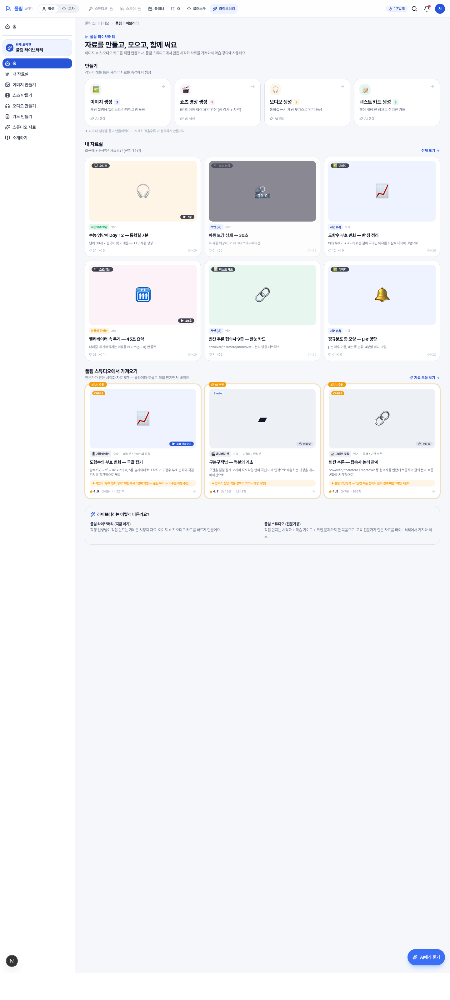

**역할**: 라이브러리 도메인 진입점. 4 생성기 + 내 자료실 미리보기 + 스튜디오 자료 임포트 섹션 + 분업 안내.

**섹션 구성**

1. **헤더** — eyebrow "풀림 라이브러리" / 제목 "자료를 만들고, 모으고, 함께 써요" / 한줄 설명
2. **만들기** — 4 생성 진입 카드 (이미지·쇼츠·오디오·카드). 각 카드에 type별 톤색·이모지·완성된 자료 갯수 칩
3. **내 자료실** — 최근 6건 카드 그리드. "전체 보기 →" 링크 (→ `/library/storage`)
4. **풀림 스튜디오에서 가져오기** — AI 추천 VLM 3건. "자료 모음 보기 →" 링크
5. **라이브러리는 어떻게 다른가요?** — 스튜디오 vs 라이브러리 분업 안내 카드

**데이터 의존**: `myLibrary`, `getRecommendedVlms()`, `visualLibrary`, `mediaKindMeta`

**기능 명세**

| ID | 기능 | 변경 위치 |
|---|---|---|
| F-LIB-HUB-01 | 4 생성기 진입 카드 (`GeneratorEntryCard`) | `components/visual/generator-entry-card.tsx` + 허브 page generatorOrder 배열 |
| F-LIB-HUB-02 | 카드별 ready 상태 자료 갯수 chip | 허브 page `countByKind()` |
| F-LIB-HUB-03 | 내 자료실 최근 6건 표시 | 허브 page `recentMine` slice(0, 6) |
| F-LIB-HUB-04 | 전체 보기 링크 → `/library/storage` | 허브 page action prop |
| F-LIB-HUB-05 | 스튜디오 추천 VLM 3건 | `getRecommendedVlms().slice(0, 3)` |
| F-LIB-HUB-06 | 분업 안내 카드 | 허브 page 마지막 section (정적 텍스트) |

---

### 1.2 내 자료실 — `/library/storage`

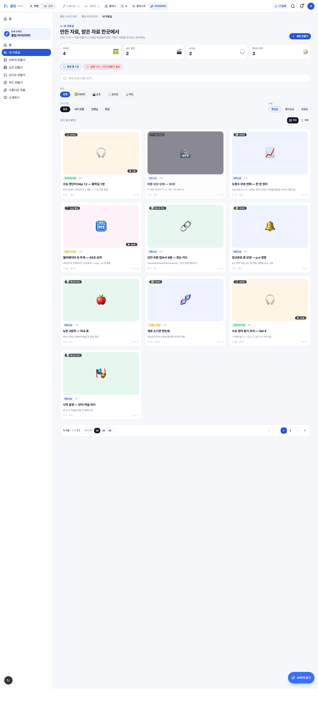

**역할**: 만든·받은 모든 미디어를 한곳에서 검색·필터·정렬·페이징 관리. 카드/목록 뷰 토글.

**섹션 구성**

1. **헤더** — 전체 N건, "새로 만들기" CTA (→ `/library`)
2. **종합 통계 4 카드** — 종류별 갯수(이미지·쇼츠·오디오·카드). 카드 클릭 = 종류 필터 토글
3. **상태 알림** — 생성 중·실패 자료 갯수 칩 (해당 상태 있을 때만 노출, 클릭 시 상태 필터)
4. **검색** — 제목·요약·단원·prompt 모두 매칭
5. **필터 row 1** — 종류 (전체/이미지/쇼츠/오디오/카드)
6. **필터 row 2** — 누가 만든 (모두/내가/선생님/학급) | 정렬 (최신/좋아요/공유)
7. **결과 카운트 + 뷰 토글** — N건 결과 / [필터 모두 지우기] / [카드/목록]
8. **결과 영역** — 그리드(MediaCard) 또는 목록(MediaListView)
9. **페이지네이션 바** — N–M / 전체 / 페이지당 [10|20|50] / [«][‹] [1]…[10] [›][»]

**페이지네이션 규칙**
- 페이지 사이즈: 10 / 20 / 50 (기본 10, localStorage 유지)
- 페이지 번호 버튼: **10개 단위로 chunk** — 1~10 → 11~20 → ...
- `«` 첫 페이지 / `‹` 이전 chunk / 번호 / `›` 다음 chunk / `»` 마지막
- 필터·정렬·검색·사이즈 변경 시 자동 1페이지 복귀

**뷰 토글 (목록 뷰)**

목록 뷰는 lg+ 화면에서 8열(미리보기·제목/요약·소유자·과목·길이·❤·↗·날짜) 표 형식으로 표시. 카드보다 행당 정보 밀도 높음. localStorage `pullim:library:storage:view` 로 사용자 선호 유지.

**데이터 의존**: `myLibrary`, `mediaKindMeta`

**기능 명세**

| ID | 기능 | 변경 위치 |
|---|---|---|
| F-LIB-STO-01 | 종합 통계 4 카드 + 클릭 필터 | storage page `countByKind()` 섹션 |
| F-LIB-STO-02 | 생성중·실패 상태 알림 칩 | storage page status 섹션 |
| F-LIB-STO-03 | 검색 (제목/요약/단원/prompt) | `useMemo(filtered)` |
| F-LIB-STO-04 | 종류 필터 (5개) | `kindFilters` 배열 |
| F-LIB-STO-05 | 소유자 필터 (4개) | `ownerFilters` 배열 |
| F-LIB-STO-06 | 정렬 옵션 (3개) | `sortOptions` 배열 |
| F-LIB-STO-07 | 카드/목록 뷰 토글 | `view` state + localStorage |
| F-LIB-STO-08 | 페이지 사이즈 선택 (10/20/50) | `PAGE_SIZE_OPTIONS` |
| F-LIB-STO-09 | 페이지 번호 chunk 10 | `PAGE_NAV_CHUNK` 상수 |
| F-LIB-STO-10 | 필터 변경 시 1페이지 복귀 | wrapped setters |
| F-LIB-STO-11 | 목록 뷰 컬럼 8개 (lg+) | `MediaListRow` 컴포넌트 |
| F-LIB-STO-12 | 빈 상태 + 새로 만들기 CTA | `filtered.length === 0` 분기 |

---

### 1.3 이미지 만들기 — `/library/create/image`

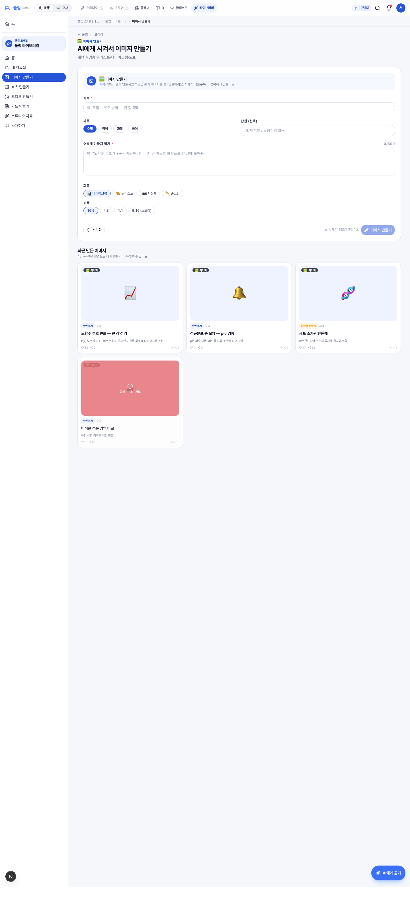

**역할**: AI에게 시켜서 이미지 자료 생성. 폼 입력 → 모의 toast → "내 자료실에 저장했어요".

**섹션 구성**

1. **헤더** — 뒤로가기 (→ `/library`) / eyebrow 종류 / 제목 / 한줄 설명
2. **`LibraryGeneratorForm`** — 인트로 카드 + 제목·과목·단원·"어떻게 만들지" + 종류별 옵션
3. **최근 만든 이미지** — 같은 종류 최근 6건 (`getLibraryByKind('image')`)

**이미지 종류별 옵션**
- 화풍: 다이어그램 📊 / 일러스트 🎨 / 사진풍 📷 / 손그림 ✏️
- 비율: 16:9 / 4:3 / 1:1 / 9:16(스토리)

**기능 명세**

| ID | 기능 | 변경 위치 |
|---|---|---|
| F-LIB-CRT-01 | 동적 라우트 (4 type) | `app/(student)/library/create/[type]/page.tsx` + `generateStaticParams` |
| F-LIB-CRT-02 | 잘못된 type → notFound | VALID_KINDS 검증 |
| F-LIB-CRT-03 | 인트로 카드 (종류별 아이콘·라벨) | `LibraryGeneratorForm` |
| F-LIB-CRT-04 | 제목 (필수, 60자) | `<input>` + maxLength |
| F-LIB-CRT-05 | 과목 4 (수학·영어·과학·국어) | `subjectOptions` |
| F-LIB-CRT-06 | 단원 (선택, 50자) | `<input>` |
| F-LIB-CRT-07 | "어떻게 만들지" 텍스트영역 (필수, 500자) | `<textarea>` + 종류별 hint |
| F-LIB-CRT-08 | 종류별 옵션 칩 (이미지: 화풍·비율) | `optionsByKind.image` |
| F-LIB-CRT-09 | 생성 버튼 (제목·prompt 검증 후 활성) | `canGenerate` |
| F-LIB-CRT-10 | mock 생성 toast (1.8초 후 완료) | `handleGenerate` setTimeout |

---

### 1.4 쇼츠 만들기 — `/library/create/short`

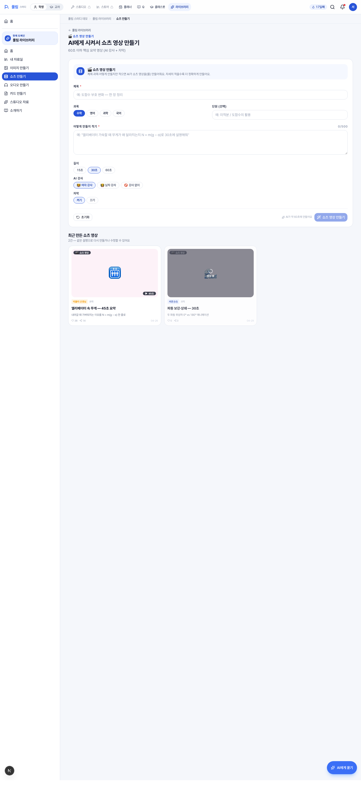

**역할**: 60초 이하 핵심 요약 영상 (AI 강사 + 자막) 생성.

**쇼츠 종류별 옵션**
- 길이: 15초 / 30초 / 60초
- AI 강사: 여자 강사 👩‍🏫 / 남자 강사 👨‍🏫 / 강사 없이 🚫
- 자막: 켜기 / 끄기

**기능 명세**: F-LIB-CRT-* 와 동일. `optionsByKind.short` 만 다름.

---

### 1.5 오디오 만들기 — `/library/create/audio`

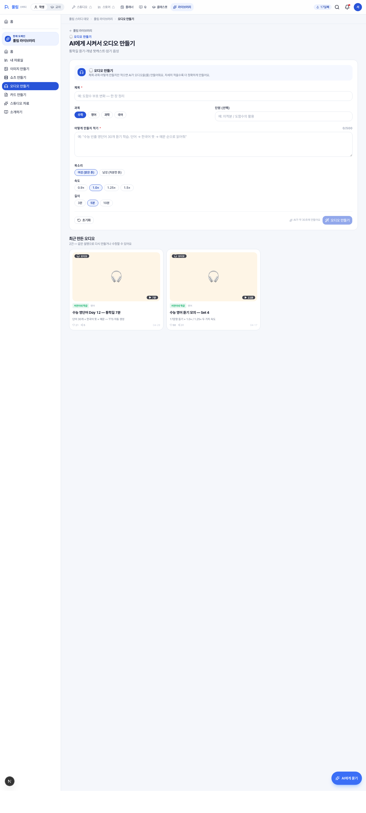

**역할**: 통학길 듣기·암기 음성·개념 팟캐스트 생성.

**오디오 종류별 옵션**
- 목소리: 여성(밝은 톤) / 남성(차분한 톤)
- 속도: 0.9× / 1.0× / 1.25× / 1.5×
- 길이: 3분 / 5분 / 10분

**기능 명세**: F-LIB-CRT-* 와 동일. `optionsByKind.audio`.

---

### 1.6 카드 만들기 — `/library/create/card`

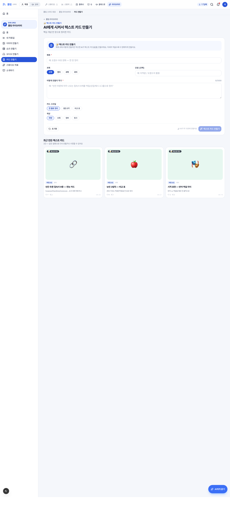

**역할**: 핵심 개념 한 장 정리 카드 (썸네일 + 한줄 정의 / 3줄 요약 / 비교 표).

**카드 종류별 옵션**
- 카드 스타일: 한 줄로 정리 / 3줄 요약 / 비교 표
- 색상: 파랑 / 초록 / 앰버 / 핑크

**기능 명세**: F-LIB-CRT-* 와 동일. `optionsByKind.card`.

---

### 1.7 미디어 상세 — 이미지

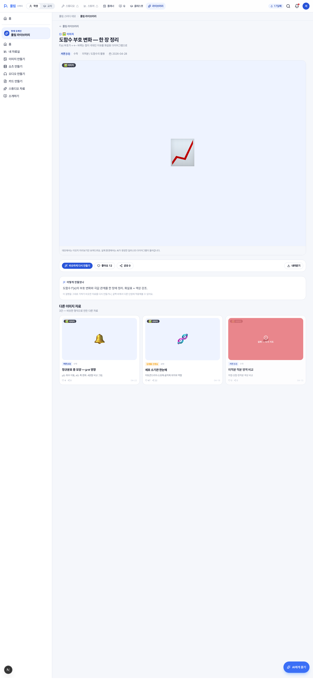

**역할**: 만든·받은 미디어 한 건의 상세 화면. 종류별 미리보기 + 액션 버튼 + "어떻게 만들었나" prompt 공개 + 같은 종류 다른 자료.

**섹션 구성** (4종 공통)

1. **뒤로가기** → `/library`
2. **헤더** — eyebrow(종류 칩) / 제목 / 요약
3. **메타 한 줄** — 소유자 / 과목 / 단원 / 날짜 / 길이
4. **종류별 미리보기** (이미지: 4:3 큰 이모지 + "이미지" 칩 + 안내)
5. **액션 바** — 비슷하게 다시 만들기 (→ `/library/create/{kind}`) / 좋아요 / 공유 / 내려받기
6. **어떻게 만들었나** — 생성 prompt 그대로 공개 + "복제·변형 가능" 안내
7. **다른 같은 종류 자료** — 같은 kind 다른 3건 grid

**기능 명세**

| ID | 기능 | 변경 위치 |
|---|---|---|
| F-LIB-DET-01 | 동적 라우트 + generateStaticParams | `app/(student)/library/[id]/page.tsx` |
| F-LIB-DET-02 | 미발견 시 notFound | `findLibraryMedia(id)` |
| F-LIB-DET-03 | 종류별 MediaPreview switch | `ImagePreview` / `ShortPreview` / `AudioPreview` / `CardPreview` |
| F-LIB-DET-04 | 액션 — 비슷하게 다시 만들기 링크 | `/library/create/${media.kind}` |
| F-LIB-DET-05 | 액션 — 좋아요·공유·내려받기 (mock) | 액션 바 버튼 (실제 동작 없음) |
| F-LIB-DET-06 | "어떻게 만들었나" prompt 공개 | `media.prompt` |
| F-LIB-DET-07 | 같은 종류 다른 3건 추천 | `getLibraryByKind(media.kind).filter(...).slice(0, 3)` |

---

### 1.8 미디어 상세 — 쇼츠

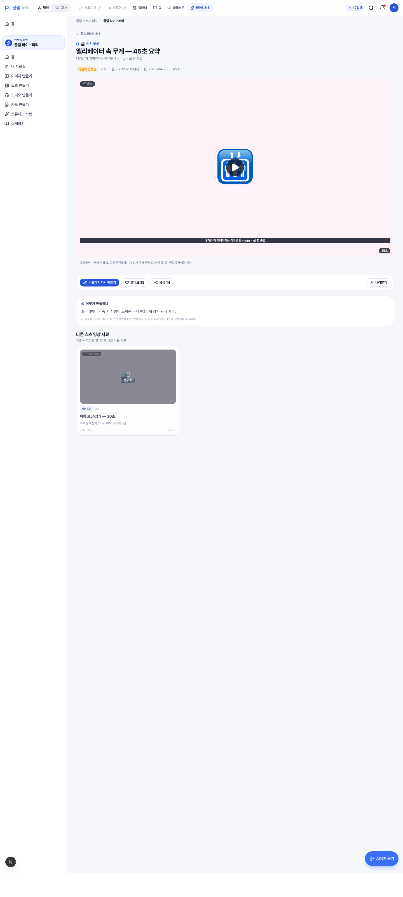

**쇼츠 미리보기**: 비디오 프레임 + 가운데 재생버튼 + 자막 흉내(요약 텍스트) + 우하단 길이 칩 ("45초" 등).

**기능 명세**: F-LIB-DET-* 동일. `ShortPreview` 컴포넌트.

---

### 1.9 미디어 상세 — 오디오

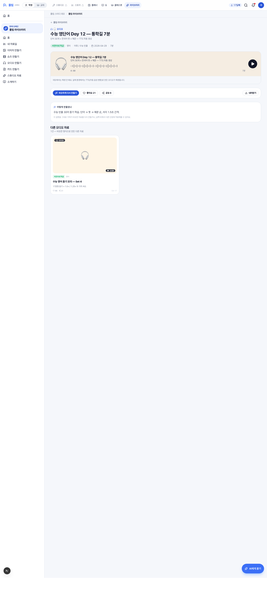

**오디오 미리보기**: 가로형 플레이어 — 큰 이모지 + 제목·요약 + 가짜 wave bar (32개) + 0:00/길이 + 우측 재생버튼.

**기능 명세**: F-LIB-DET-* 동일. `AudioPreview` 컴포넌트.

---

### 1.10 미디어 상세 — 텍스트 카드

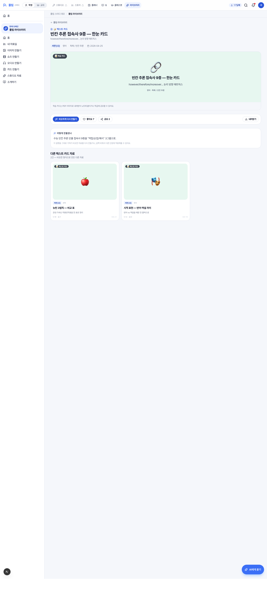

**카드 미리보기**: 학습 카드 그대로 렌더 — 톤 컬러 배경 + 가운데 큰 이모지 + 제목 + 요약 + 과목·단원. PDF·이미지 내려받기 안내.

**기능 명세**: F-LIB-DET-* 동일. `CardPreview` 컴포넌트.

---

### 1.11 풀림 스튜디오 자료 모음 — `/library/visual`

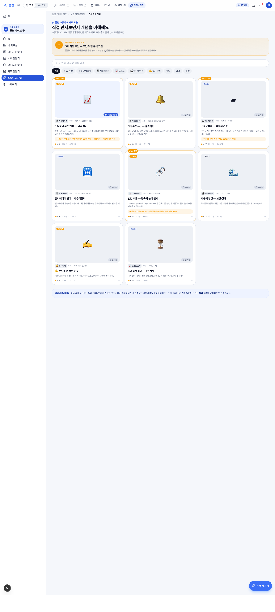

**역할**: 풀림 스튜디오에서 만든 시각화 자료(`visualLibrary`) 카탈로그. AI 추천 강조 + 검색 + 필터(과목/타입/직접 만져보기 가능).

**섹션 구성**

1. **헤더** — eyebrow "풀림 스튜디오 자료 모음" / 제목 "직접 만져보면서 개념을 이해해요"
2. **AI 추천 hero** — 추천 자료 N개 자동 매칭 (오답 분석 기반)
3. **검색** — 단원·개념·자료 제목
4. **필터 chips** — 전체 / AI 추천 / 직접 만져보기 / 시뮬레이션 / 그래프 / 애니메이션 / 필기 인식 / 수학 / 영어 / 과학
5. **VLM 카드 그리드** — 4열까지 반응형 (`VlmCard` 컴포넌트)
6. **FlywheelNote** — 라이브러리 → 분석 → 복습 환류 안내

**기능 명세**

| ID | 기능 | 변경 위치 |
|---|---|---|
| F-LIB-VIS-01 | AI 추천 hero | `getRecommendedVlms()` |
| F-LIB-VIS-02 | 검색 (제목/단원/개념) | `useMemo(filtered)` |
| F-LIB-VIS-03 | 필터 chips (10개) | `filters` 배열 |
| F-LIB-VIS-04 | VLM 카드 (`VlmCard`) | `components/visual/vlm-card.tsx` |
| F-LIB-VIS-05 | 빈 상태 안내 | `filtered.length === 0` |
| F-LIB-VIS-06 | FlywheelNote 환류 메시지 | `components/shell/flywheel-note.tsx` |

---

### 1.12 시각화 자료 상세 — `/library/visual/[id]`

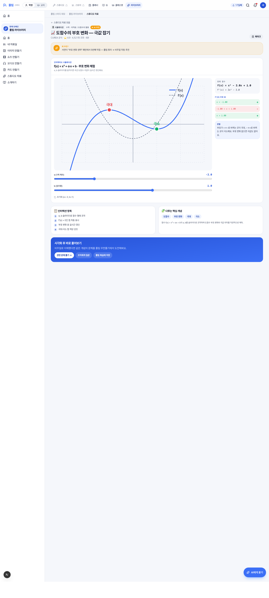

**역할**: 단일 VLM 상세. **데모에서는 "도함수 부호 변화" 자료만 실제 시뮬레이션 동작** (`DerivativeSignSim`), 나머지는 "조작 화면 준비 중" placeholder.

**섹션 구성**

1. **뒤로가기** → `/library/visual` ("스튜디오 자료 모음")
2. **헤더** — 종류 칩 + 과목·단원 + AI 추천 칩 / 제목 / 작성자·평점·조회수 / 북마크 버튼
3. **AI 추천 사유** (해당 시) — 노란 카드 "왜 추천?"
4. **시뮬레이션 / 플레이스홀더** — math-derivative-sign이면 실제 시뮬, 그 외는 큰 이모지 + 안내
5. **인터랙션 항목** + **다루는 핵심 개념** — 와이드 2-col
6. **다음 액션** — 블루 그라디언트 카드: 관련 문제 풀기 / 코치에게 질문 / 풀림 복습에 저장

**기능 명세**

| ID | 기능 | 변경 위치 |
|---|---|---|
| F-LIB-VLM-01 | 동적 라우트 + generateStaticParams | `app/(student)/library/visual/[id]/page.tsx` |
| F-LIB-VLM-02 | 도함수 부호 변화 실제 시뮬 | `components/visual/derivative-sign-sim.tsx` |
| F-LIB-VLM-03 | 그 외 자료 placeholder + "실제 시뮬레이션 보기" 링크 | placeholder section |
| F-LIB-VLM-04 | AI 추천 사유 카드 | `vlm.aiRecommended && vlm.recommendationReason` |
| F-LIB-VLM-05 | 인터랙션 N개 리스트 | `vlm.interactions` |
| F-LIB-VLM-06 | 핵심 개념 chips | `vlm.concepts` |
| F-LIB-VLM-07 | 다음 액션 — Q 도메인 진입 | `/q/infinity/solve`, `/q/talk`, `/q/review` |
| F-LIB-VLM-08 | 북마크 (mock) | 헤더 우측 버튼 |

---

### 1.13 소개하기 — `/library/visual/onboarding`

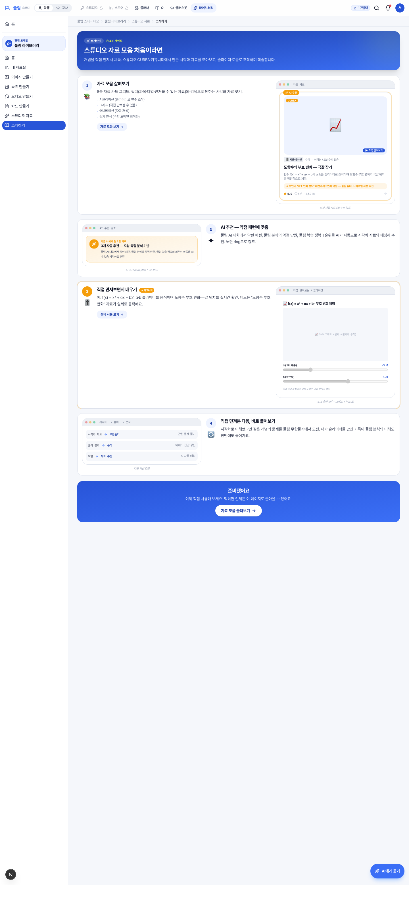

**역할**: 4분 사용법 가이드 (`OnboardingTemplate` 사용). 4 step으로 라이브러리 사용법 안내.

**4 step**
1. 자료 모음 살펴보기 (필터·검색·시뮬레이션 4종)
2. AI 추천 — 약점 패턴에 맞춤
3. 직접 만져보면서 배우기 (실제 시뮬 데모)
4. 직접 만져본 다음, 바로 풀어보기 (Q 도메인 환류)

**기능 명세**

| ID | 기능 | 변경 위치 |
|---|---|---|
| F-LIB-OBD-01 | OnboardingTemplate 사용 | `components/shell/onboarding-template.tsx` |
| F-LIB-OBD-02 | 4 step 콘텐츠 (텍스트·CTA·MockBrowser) | onboarding page `steps` array |
| F-LIB-OBD-03 | 시뮬 step에 실제 슬라이더 미리보기 | step 3 mock UI |
| F-LIB-OBD-04 | 마지막 CTA → /library/visual | `finalCta` |

---

## 2. 데이터 모델

### 2.1 `LibraryMedia` (자료 1건)

```typescript
type LibraryMedia = {
  id: string;
  kind: 'image' | 'short' | 'audio' | 'card';
  title: string;
  subject: SubjectKey;             // math | english | science | korean | social | history
  unit: string;
  summary: string;                  // 한줄 요약 (썸네일 캡션)
  prompt: string;                   // 생성에 사용한 설명 (요약)
  owner: 'me' | 'teacher' | 'class';
  ownerLabel: string;               // "서연 (나)", "박물리 선생님" 등
  createdAt: string;                // ISO date
  durationSec?: number;             // 영상=초, 오디오=분, 그 외 0
  thumbEmoji: string;
  shares: number;
  likes: number;
  status: 'ready' | 'generating' | 'failed';
};
```

### 2.2 `MediaKind` 메타

```typescript
type MediaKind = 'image' | 'short' | 'audio' | 'card';

const mediaKindMeta: Record<MediaKind, {
  label: string;
  emoji: string;
  tagline: string;
  tone: 'blue' | 'pink' | 'amber' | 'green';
}>;
```

### 2.3 `VLM` (스튜디오 자료)

```typescript
type VLM = {
  id: string;
  title: string;
  subject: SubjectKey;
  unit: string;
  type: 'simulation' | 'graph' | 'animation' | 'handwriting';
  origin: 'studio' | 'cured' | 'community';
  author: string;
  rating: number;
  views: number;
  duration: number;                 // 분
  concepts: string[];
  interactions: string[];
  aiRecommended?: boolean;
  recommendationReason?: string;
  hasInteractive: boolean;          // true=실제 동작, false=placeholder
};
```

### 2.4 mock 데이터

| 데이터 | 위치 | 건수 |
|---|---|---|
| `myLibrary` (LibraryMedia[]) | `lib/mock/visual.ts` | 11 (ready 9, generating 1, failed 1) |
| `visualLibrary` (VLM[]) | `lib/mock/visual.ts` | 8 (수학 4, 과학 2, 영어 2) |

---

## 3. 컴포넌트 카탈로그

### 라이브러리 도메인 컴포넌트 (`components/visual/`)

| 컴포넌트 | 사용처 | 책임 |
|---|---|---|
| `GeneratorEntryCard` | 허브 만들기 섹션 | 4종 생성기 진입 카드 (톤색·이모지·count chip) |
| `MediaCard` | 허브, 자료실, 상세 추천 | 미디어 1건 카드 (썸네일·종류 칩·소유자·메타) |
| `LibraryGeneratorForm` | 4 생성 페이지 | 클라이언트 폼 (제목·과목·단원·prompt·옵션·생성 버튼) |
| `VlmCard` | 스튜디오 자료 모음, 허브 | VLM 1건 카드 (썸네일·인터랙티브 칩·AI 추천 강조) |
| `DerivativeSignSim` | math-derivative-sign 상세 | 도함수 부호 시뮬 (a,b 슬라이더·그래프·부호표) |

### 공유 셸 의존 (read only)

| 컴포넌트 | 사용처 |
|---|---|
| `PageHeader` | 모든 화면 헤더 |
| `SectionHeading` | 허브·자료실 섹션 헤더 |
| `OnboardingTemplate` | 소개하기 |
| `MockBrowser` | 소개하기 데모 화면 |
| `FlywheelNote` | 스튜디오 자료 모음 하단 |

---

## 4. 라우트 매핑

| 라우트 | 파일 | 타입 | 동적 |
|---|---|---|---|
| `/library` | `app/(student)/library/page.tsx` | server | — |
| `/library/storage` | `app/(student)/library/storage/page.tsx` | client | — |
| `/library/create/[type]` | `app/(student)/library/create/[type]/page.tsx` | server | 4건 (image/short/audio/card) |
| `/library/[id]` | `app/(student)/library/[id]/page.tsx` | server | 11건 (myLibrary 모두) |
| `/library/visual` | `app/(student)/library/visual/page.tsx` | client | — |
| `/library/visual/[id]` | `app/(student)/library/visual/[id]/page.tsx` | server | 8건 (visualLibrary 모두) |
| `/library/visual/onboarding` | `app/(student)/library/visual/onboarding/page.tsx` | server | — |

**Next.js 라우트 우선순위**: 정적 segment(`create`, `visual`, `storage`)가 동적 segment(`[id]`)보다 우선. → `/library/visual` 먼저 매칭, `/library/lib-img-derivative` 는 `[id]` 매칭.

---

## 5. 사이드바 진입 (nav-config.ts: librarySection)

```
홈                  → /library
내 자료실           → /library/storage
이미지 만들기       → /library/create/image
쇼츠 만들기         → /library/create/short
오디오 만들기       → /library/create/audio
카드 만들기         → /library/create/card
스튜디오 자료       → /library/visual
소개하기            → /library/visual/onboarding
```

상단 GNB "풀림 라이브러리" 진입 시 사이드바가 librarySection으로 swap.

---

## 6. 변경 가이드 — 자주 손볼 항목

### 새 미디어 종류 추가 (예: 'pdf' 추가)

1. `lib/mock/visual.ts` — `MediaKind` union에 `'pdf'` 추가
2. `lib/mock/visual.ts` — `mediaKindMeta.pdf` 정의 (label·emoji·tagline·tone)
3. `lib/mock/visual.ts` — `myLibrary` mock에 샘플 1~2건 추가
4. `app/(student)/library/page.tsx` — `generatorOrder` 배열에 `'pdf'` 추가
5. `app/(student)/library/create/[type]/page.tsx` — `VALID_KINDS` 배열에 추가
6. `components/visual/library-generator-form.tsx` — `optionsByKind.pdf` + `hintByKind.pdf` + `kindLeadIcon.pdf`
7. `app/(student)/library/[id]/page.tsx` — `MediaPreview` switch에 PDF case 추가 + `PdfPreview` 컴포넌트 작성
8. `components/shell/nav-config.ts` — `librarySection` 에 `/library/create/pdf` 항목 추가
9. `components/visual/media-card.tsx` — kindToneBg 가 새 tone 색 처리

### 페이지네이션 chunk 크기 변경

- `app/(student)/library/storage/page.tsx` — `PAGE_NAV_CHUNK` 상수 (기본 10)

### 페이지 사이즈 옵션 변경 (10/20/50 → 다른 값)

- `app/(student)/library/storage/page.tsx` — `PAGE_SIZE_OPTIONS` 배열 + `PageSize` type union

### 미디어 상세 액션 추가 (예: "PDF로 변환")

- `app/(student)/library/[id]/page.tsx` — 액션 바 section에 버튼 추가 + 핸들러

### 새 시각화 자료(VLM) 추가

- `lib/mock/visual.ts` — `visualLibrary` 배열에 객체 추가
- 인터랙티브 시뮬 만들 거면 `components/visual/<name>-sim.tsx` 컴포넌트 + `app/(student)/library/visual/[id]/page.tsx` 분기

### 추천 알고리즘 (현재는 mock)

- `lib/mock/visual.ts` — `getRecommendedVlms()` 는 단순히 `aiRecommended === true` 필터. 실제 구현은 별도 API 연결 필요.

---

## 7. 사용된 디자인 토큰

| 토큰 | 용도 |
|---|---|
| `pullim-blue-{50..950}` | primary, 학생 도메인 표식, 활성 상태 |
| `pullim-slate-{0..950}` | 텍스트, 보더, 중성 배경 |
| `pullim-warn` (#F59E0B) | AI 추천 강조, 오디오 톤, 선생님 소유자 칩 |
| `pullim-success` (#12B26B) | 카드 톤, 학급 소유자 칩, "완성" 상태 |
| `pullim-danger` (#E5484D) | 실패 상태, 필수 표시 |
| `pink-{50..700}` (Tailwind raw) | 쇼츠 톤 |

---

## 8. 의존 외부 라이브러리

| 라이브러리 | 사용처 |
|---|---|
| Next.js 16.2.4 | App Router, 동적 라우트, generateStaticParams |
| React 19 | 클라이언트 컴포넌트 ('use client') |
| Tailwind CSS v4 | 모든 스타일 |
| `lucide-react` | 모든 아이콘 |
| `sonner` | 생성 toast |
| `@base-ui/react` | Button 프리미티브 |
| `class-variance-authority` (cva) | Button variant 시스템 |

---

## 9. 알려진 데모 한계

| 항목 | 현 상태 | 실 환경 |
|---|---|---|
| 미디어 생성 | mock toast, 1.8초 후 "완료" | 실제 AI API 호출 (이미지·영상·TTS 파이프라인) |
| 시뮬레이션 동작 | math-derivative-sign 1건만 실 동작 | 200+ 템플릿 (마스터 문서 기준) |
| 좋아요·공유·내려받기 | 정적 카운트, 클릭 동작 없음 | 백엔드 연동 |
| 북마크 | 버튼만 존재, 동작 없음 | 사용자 컬렉션 저장 |
| AI 추천 사유 | 정적 텍스트 | 학습 분석 결과 연동 |
| 학급 공유 | 정적 ownerLabel | 학급 권한·실시간 sync |
| 로그인·권한 | 없음 (currentPersona = 서연) | OAuth + 학생/교사 권한 |

---

## 10. 다음 작업 후보

- [ ] `(teacher)/library/` 신설 — 교사 측 라이브러리 진입 (학생과 별개 IA)
- [ ] 미디어 일괄 선택 (체크박스) — 일괄 삭제·공유·PDF 묶음 내려받기
- [ ] 학급 공유 모달 — 누구에게, 만료 일자, 댓글
- [ ] 자료 버전 관리 — "이 자료 다시 만들기" 시 새 버전으로 보존
- [ ] 검색 highlight — 매칭 토큰 강조
- [ ] 무한 스크롤 (페이지네이션 대안)
- [ ] 정렬에 "내가 만든·내가 받은" 분리 추가
- [ ] AI 추천 로직 실 구현 (오답 분석 → 적합 미디어 매칭)

---

> 이 문서는 풀림 라이브러리 도메인의 현재 상태(2026-04-30 기준) 스냅샷입니다. 화면이 바뀌면 스크린샷·기능 명세를 같이 갱신해야 합니다. 변경 가이드(§6)를 먼저 확인하면 어디를 수정해야 하는지 빠르게 찾을 수 있습니다.
